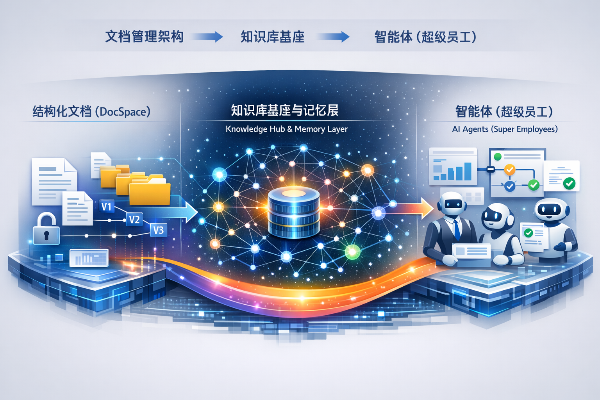
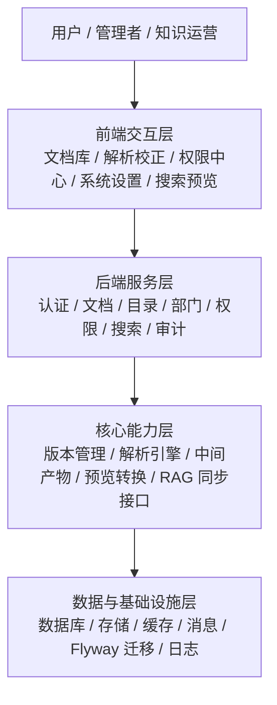

# DocSpace 项目整体介绍

## 一、整体介绍

DocSpace 不是一个单点的文档管理工具，而是一条面向未来组织形态的能力建设路线。项目以企业文档为起点，逐步向知识库基座、企业级记忆层和业务智能体 Skill 体系演进，最终支撑“超级员工”的构建。

从建设节奏上看，DocSpace 采用三阶段递进策略。第一阶段先夯实文档管理与治理底座，解决资料沉淀、权限控制、版本管理和内容解析的问题；第二阶段把文档资产升级为企业知识资产，形成可检索、可复用、可记忆的知识底座；第三阶段再将这些知识能力封装成面向业务的 Skill，推动组织从传统公司向硅基公司平滑转型。

这条路径的价值，在于每一阶段都能独立创造业务收益，同时又能自然衔接下一阶段，不需要推倒重来。对管理层而言，这不是一次性的大而全投入，而是一套低风险、可治理、可持续演进的企业能力升级方案。


## 二、项目愿景

DocSpace 的目标，不是只做一个文档管理系统，而是以企业文档为起点，逐步建设知识库基座、企业级知识记忆层，以及面向业务的智能体 Skill 体系，最终形成可以持续进化的“超级员工”能力平台。

这条路线对应公司能力建设的三次跃迁：

- 从“信息分散”走向“文档资产化”
- 从“文档沉淀”走向“知识结构化”
- 从“知识可用”走向“能力智能化”

最终，我们希望这套架构能够以低风险、渐进式、可治理的方式，支持公司从传统公司向硅基公司转变。


## 三、三阶段路线总览

| 阶段 | 阶段目标 | 核心交付 | 组织价值 |
| --- | --- | --- | --- |
| 第一阶段 | 搭建文档管理架构 | 文档库、权限、版本、解析、审计、搜索、预览、配置能力 | 让企业文档从“可存放”升级为“可管理、可追溯、可加工” |
| 第二阶段 | 建立知识库基座与企业级知识记忆层 | 知识建模、知识加工、检索增强、记忆服务、知识治理 | 让企业知识从“可查找”升级为“可理解、可复用、可沉淀” |
| 第三阶段 | 搭建智能体业务 Skill 体系 | 业务 Skill、工具接入、工作流编排、监督与反馈闭环 | 让企业能力从“靠人执行”升级为“人机协同、智能执行、持续优化” |

## 四、第一阶段：文档管理架构搭建（当前重点）

### 1. 第一阶段的目标

第一阶段的核心，不是单纯把文档“收进系统”，而是先搭起一个可信、可治理、可扩展的文档资产底座，为后续知识化和智能体化打基础。

当前阶段的重点目标包括：

- 建立统一的企业文档入口，承接文档上传、分类、浏览、搜索和预览
- 建立文档版本体系，保证内容演进可追踪、可回溯、可审计
- 建立权限与角色体系，确保文档流转和知识使用可控
- 建立解析与人工校正能力，把原始文件逐步转化为可被知识库消费的结构化内容
- 建立配置化的解析引擎与中间产物管理能力，为后续知识加工链路预埋标准接口
- 让系统具备从“文档管理工具”向“知识生产平台”演进的工程基础

### 2. 第一阶段的项目定位

第一阶段可以理解为整个项目的“基础设施层”与“治理层”。它解决的是三个根问题：

- 企业资料能不能统一沉淀
- 企业内容能不能标准化治理
- 企业资产能不能为后续 AI 使用做好准备

如果这一阶段做扎实，第二阶段的知识库不会成为“无源之水”，第三阶段的智能体也不会建立在混乱、不可控的知识之上。

### 3. 当前项目架构

从当前项目形态来看，已经具备清晰的分层架构，能够支撑第一阶段目标落地。



#### 交互层

当前前端已经围绕文档库场景形成主界面能力，包括：

- 文档库与目录管理
- 文档上传、查看、版本历史
- 解析结果查看与人工校正
- 权限中心与系统设置
- 搜索、帮助中心、仪表盘等辅助能力

这一层的价值，是把复杂的文档治理能力，转化为业务人员可直接使用的统一入口。

#### 服务层

当前后端已经形成以业务域为中心的服务分层，覆盖：

- 认证与用户身份体系
- 文档、目录、版本、审计等核心服务
- 部门、用户、角色、菜单、权限等治理服务
- 搜索、查询、解析、产物读取等能力服务

这一层的价值，是把文档管理、权限管理、内容处理和治理流程固化为稳定的服务能力。

#### 核心能力层

第一阶段最关键的建设价值，体现在几个“为未来预留空间”的能力点上：

- 解析引擎配置化：不同文件类型与解析能力可以解耦管理
- 中间产物可视化：文本、图片、Markdown 等过程产物可追踪、可校验
- 版本化管理：每次解析与修订都可以绑定到具体版本
- 审计与权限控制：保障后续知识和智能体使用的可信边界
- RAG 对接预留：为第二阶段知识库接入保留标准入口

这意味着第一阶段虽然看起来在做文档管理，但实际上已经在搭建知识工厂的前置生产线。

#### 数据与基础设施层

当前项目的数据与基础设施层，已经具备较好的企业级演进条件：

- 通过数据库迁移管理核心数据模型演进
- 具备文档、版本、解析产物、权限、审计等核心实体模型
- 具备对象存储、缓存、消息机制等扩展支撑能力
- 具备本地开发环境与日志沉淀能力，便于持续迭代和稳定运行

这一层的价值，是保证后续知识规模扩展、解析能力扩展、智能体能力扩展时，不需要推倒重来。

### 4. 第一阶段的阶段性成果定义

第一阶段完成时，项目应具备以下标志：

- 企业文档能够统一接入、统一管理、统一检索
- 文档生命周期具备版本、权限、审计、发布与校正能力
- 核心文件类型具备稳定解析能力，并能沉淀中间产物
- 系统已经不是“文件仓库”，而是“知识加工前台”
- 第二阶段所需的知识加工、向量化、记忆化链路可以在此基础上继续扩建

## 五、第二阶段：知识库基座与企业级知识记忆层

### 1. 第二阶段的目标

第二阶段的核心目标，是把第一阶段沉淀下来的文档资产，进一步加工为企业可持续复用的知识资产，并形成企业级记忆层。

这一阶段的重点，不再是“有没有文档”，而是“系统能否理解、组织和调用知识”。

### 2. 第二阶段的建设重点

- 建立统一的知识对象模型，把文档内容转化为知识条目、知识片段、规则、流程、案例、FAQ 等可复用单元
- 建立知识加工链路，包括切分、清洗、标注、分类、标签化、摘要化和质量校验
- 建立检索增强能力，支持关键词检索、语义检索、混合检索和权限过滤
- 建立企业级记忆层，逐步沉淀组织记忆、部门记忆、岗位记忆、项目记忆和任务记忆
- 建立知识治理机制，解决知识时效性、可信度、版本一致性和权限边界问题
- 建立知识反馈闭环，让用户使用、纠错、引用、问答行为反哺知识质量

### 3. 第二阶段的核心产出

第二阶段完成后，系统将从“文档平台”升级为“知识平台”，具备以下能力：

- 企业知识可持续沉淀，而不是停留在文件夹和个人经验中
- 企业知识可检索、可组合、可引用、可追溯
- 企业知识具备长期记忆与持续更新能力
- 企业知识能够为大模型、工作流和智能体稳定供给高质量上下文

第二阶段的本质，是为公司搭建“企业大脑的长期记忆层”。

## 六、第三阶段：业务 Skill 体系与超级员工建设

### 1. 第三阶段的目标

第三阶段的目标，是把前两阶段沉淀下来的知识能力进一步封装成可执行、可编排、可治理的业务 Skill，并最终形成面向多个岗位和业务流程的“超级员工”体系。

这时系统的核心不再只是“知道什么”，而是“能够基于知识完成工作”。

### 2. 第三阶段的建设重点

- 围绕公司核心业务场景，沉淀标准化 Skill，例如销售、客服、交付、运营、管理支持等领域能力
- 打通系统工具和业务系统，让智能体能够查询、生成、执行、回写和协同
- 构建任务编排与工作流能力，让多个 Skill 可以组合成完整业务链路
- 建立监督、审批、日志、权限、风险控制等治理能力，确保智能体可控可审计
- 建立执行反馈与持续学习机制，让业务结果反哺知识库和 Skill 优化
- 逐步形成“岗位级智能体”到“组织级超级员工”的能力升级路径

### 3. 第三阶段的目标形态

第三阶段完成后，系统将具备以下组织价值：

- 知识不再只被查阅，而是能够直接参与业务执行
- 重复性工作可以由 Skill 自动承接，复杂工作由人机协同完成
- 新员工培养成本下降，组织经验可以快速复制
- 公司核心流程逐步从“依赖个体经验”转向“依赖平台化智能能力”

这将是公司迈向硅基公司的关键一步，即把企业能力从“人身上”逐步迁移到“平台化、可复制、可协同的智能系统”上。

## 七、为什么这条路径适合公司转型

这套三阶段路线的最大价值，不在于一步到位，而在于它符合企业真实转型规律：

- 先治理文档，再治理知识，最后治理智能体，风险最可控
- 每一阶段都能独立创造业务价值，而不是纯投入型建设
- 前一阶段的成果，会直接成为后一阶段的输入，不会重复建设
- 从组织视角看，这是一条“系统能力逐步替代人工记忆和重复劳动”的升级路径

因此，这不是一个孤立的 IT 项目，而是一项面向未来组织形态的基础工程。

## 八、整体介绍配图说明（供后续 OpenAI 出图）

为保证后续配图生成时不再重复讨论视觉方向，整体介绍章节后的战略蓝图配图按照以下规格执行。

### 1. 文件与版式

- 目标文件路径：`E:\AI\docspace\项目介绍\assets\整体介绍-战略蓝图.png`
- 文档内最终引用路径：`./assets/整体介绍-战略蓝图.png`
- 画幅比例：横版
- 建议尺寸：`1536x1024`
- 使用场景：项目整体介绍章节后的汇报展示图

### 2. 画面表达要求

- 整体风格采用“战略蓝图”，偏企业汇报视觉，不做夸张科幻海报化处理
- 左侧表达“文档管理架构”，突出文档、目录、权限、版本、解析等元素
- 中间表达“知识库基座与记忆层”，突出知识网络、记忆节点、知识沉淀与流动
- 右侧表达“业务 Skill 与超级员工”，突出智能体协同、业务执行与组织能力复制
- 中心视觉体现 DocSpace 平台底座，连接三个阶段，但不依赖密集文字来说明
- 图片中仅保留极少量大标题级标签，不使用密集小字承载信息

### 3. 约束条件

- 无水印
- 无英文品牌字样
- 不依赖复杂说明文字
- 不做花哨特效堆叠
- 适合直接用于 leader 汇报页

### 4. 建议提示词

```text
为企业项目汇报页生成一张横版战略蓝图风格插图，尺寸建议 1536x1024。
画面主题是 DocSpace 的三阶段演进路线，整体气质专业、清晰、克制、适合管理层汇报。
左侧展示“文档管理架构”，可视化元素包括文档、目录、权限、版本、解析流程。
中间展示“知识库基座与记忆层”，可视化元素包括知识网络、记忆节点、企业知识沉淀和流动。
右侧展示“业务 Skill 与超级员工”，可视化元素包括多个智能体协同、业务执行链路、组织能力复制。
中间以平台中枢的方式体现 DocSpace 底座，连接左右三阶段。
整体采用蓝图式信息图表达，适度科技感，避免科幻海报感。
不要水印，不要英文品牌字样，不要密集小字，不要过度炫技。
```

## 九、总结

DocSpace 当前的第一阶段，正在建设的是文档管理与治理底座；第二阶段将把文档底座升级为企业级知识底座和记忆层；第三阶段则将在此基础上沉淀业务 Skill，构建超级员工体系。

沿着这一路线推进，项目将帮助公司完成从“传统信息系统建设”到“企业知识操作系统建设”，再到“硅基公司能力建设”的连续跃迁。
