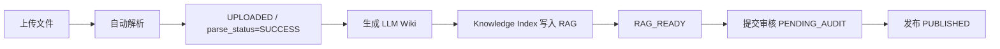

# 硅基猿猴俱乐部操作指导手册

> 面向业务人员和测试同学的第一版简明手册。当前内容以本地 Docker MVP 环境为准。

## 1. 系统入口

### 1.1 常用地址

| 用途 | 地址 | 说明 |
| --- | --- | --- |
| 硅基猿猴俱乐部管理台 | `http://localhost:3000` | Docker 静态资源容器入口，根路径会跳转到 `/m/silicon-ape-club-admin/` |
| AI 员工平台前端 | `http://localhost:3011` | AI 员工服务台、业务前台聊天、快捷能力、多模态输出和任务恢复入口 |
| AI 员工平台后端 | `http://localhost:3010` | Worker Platform API 与健康检查入口 |
| 管理台后端 | `http://localhost:8080` | 知识资产、Wiki、AI 员工、权限、审计、通知等主入口 |
| Swagger UI | `http://localhost:8080/swagger-ui/index.html` | 后端接口调试入口 |
| OpenAPI JSON | `http://localhost:8080/v3/api-docs` | 接口定义 |
| Retrieval Service | `http://localhost:8090/api/retrieval/health` | RAG 检索服务健康检查 |
| Knowledge Runtime | `http://localhost:8091/health` | AI 员工运行时服务健康检查 |
| Task Memory | `http://localhost:8092/health` | 任务记忆服务健康检查 |
| Knowledge Pipeline Worker | `http://localhost:8093/health` | 独立知识流水线 Worker 健康检查 |
| MinIO 控制台 | `http://localhost:19001` | 对象存储控制台 |
| PostgreSQL | `localhost:15432` | 用户名/库名：`docspace` |

### 1.2 默认账号

| 角色 | 用户名 | 密码 | 说明 |
| --- | --- | --- | --- |
| 管理员 | `admin` 或 `zhangsan` | `Admin@123` | 具备管理、审核、发布、权限维护能力 |
| 普通成员 | `member` 或 `lisi` | `Member@123` | 具备普通文档查看、上传等能力 |
| AI 员工平台外部客户 | `customer` | `Customer@123` | 只能查看自己的服务对话，由业务前台接待 |
| AI 员工平台内部人员 | `internal` | `Internal@123` | 可查看组织关系，并对授权员工咨询或派活 |
| AI 员工平台管理员 | `admin` | `Admin@123` | 可查看组织关系和所有员工权限 |

### 1.3 本地环境启动

在项目根目录执行：

```powershell
docker compose --profile app up -d
```

检查容器：

```powershell
docker compose --profile app ps
```

前端已纳入 Docker Compose，服务名为 `siliconapeclub-front`，容器名为 `sac-siliconapeclub-front`。如需重新构建前端静态镜像：

```powershell
cd siliconApeClub-admin\siliconApeClub-front
npm ci --registry=https://registry.npmmirror.com
npm run build:sit
cd ..\..
docker compose build siliconapeclub-front
docker compose --profile app up -d siliconapeclub-front
```

如需以前端开发模式单独启动：

```powershell
cd siliconApeClub-admin\siliconApeClub-front
npm run dev:sit
```

AI 员工平台已拆分为前后端两个 Docker 服务：

| 服务 | 容器 | 说明 |
| --- | --- | --- |
| `siliconapeclub-worker-front` | `sac-siliconapeclub-worker-front` | 前端静态资源和 `/api/worker-platform/**` 反向代理 |
| `siliconapeclub-worker-platform` | `sac-siliconapeclub-worker-platform` | 后端运行期 API、任务编排和组织派发 |

如需单独重建和启动：

```powershell
docker compose --profile app build siliconapeclub-worker-platform
docker compose --profile app build siliconapeclub-worker-front
docker compose --profile app up -d siliconapeclub-worker-platform siliconapeclub-worker-front
```

## 2. 文件管理生命周期

### 2.1 主流程



### 2.2 状态说明

| 阶段 | 业务动作 | 关键状态 | 主要数据表 |
| --- | --- | --- | --- |
| 上传 | 在管理台选择文件上传 | `status=PARSING` 或 `UPLOADED` | `ds_document`、`ds_document_version` |
| 解析 | 系统按文件类型调用解析引擎 | `parse_status=SUCCESS/FAILED` | `ds_parse_artifact`、`ds_document_audit` |
| 校正/重解析 | 人工修正文档解析内容，重新解析 | `parse_attempt_count` 增加 | `ds_document_version` |
| 生成 Wiki | 将解析内容转为 LLM Wiki | `ks_pipeline_job.status=completed` | `ks_pipeline_job`、`ks_wiki_page` |
| 写入 RAG | 生成 chunk、embedding、索引记录 | `ks_sync_job.status=success` | `ks_chunk`、`ks_index_record` |
| 待审核 | 提交管理员审核 | `status=PENDING_AUDIT` | `ds_document_audit` |
| 发布 | 管理员审核发布 | `status=PUBLISHED` | `ds_document` |
| 驳回 | 管理员驳回 | `status=REJECTED` | `ds_document_audit` |
| 修订 | 从已发布文档创建新草稿 | 新文档 `status=RAG_READY` | `ds_document`、`ds_document_version` |
| 锁定 | 禁止继续编辑当前版本 | `status=LOCKED` | `ds_document` |
| 删除 | 管理员可删除已发布/锁定文档，普通文档按权限删除 | `deleted=1`，关联 Wiki/RAG 标记 `deleted` | `ds_document`、`ks_wiki_page`、`ks_chunk`、`ks_index_record`、`ks_pipeline_job` |

### 2.3 管理台上传到 LLM Wiki 的验证路径

1. 登录硅基猿猴俱乐部管理台。
2. 上传 `docx/pdf/pptx/md/txt/sql/log/html` 等已配置解析引擎的文件。
3. 在文档列表确认解析成功：`parse_status=SUCCESS`。
4. 在文档列表点击 `生成 Wiki` / `生成 Wiki 入 RAG`，或调用文档级知识流水线接口：

```http
POST http://localhost:8080/api/documents/{documentId}/to-wiki
Authorization: Bearer <登录后 token>
Content-Type: application/json

{
  "publish": true
}
```

后台合并入口也可用于排障：

```http
POST http://localhost:8080/api/knowledge-pipeline/documents/{documentId}/to-wiki
Authorization: Bearer <登录后 token>
```

独立 Worker 补偿入口：

```http
POST http://localhost:8093/api/pipeline/documents/{documentId}/to-wiki
Content-Type: application/json

{
  "publish": true,
  "actorId": 1,
  "actorName": "张三"
}
```

5. 验证 Wiki 已生成并同步 RAG：

- `ks_pipeline_job.status=completed`
- `ks_wiki_page.status=active`
- `ks_wiki_page.sync_status=synced`
- `ks_sync_job.status=success`
- `ks_chunk.knowledge_status=active`
- `ks_acl_policy`、`ks_acl_binding` 有对应文档版本的知识 ACL

### 2.4 文档删除与知识清理

1. 普通上传或驳回文档：具备 `document.delete` 且拥有文档删除权限的用户可以删除。
2. 已发布或锁定文档：仅管理员可删除；待审核文档需要先驳回再删除。
3. 删除文档时，系统会同步清理文档生成的 LLM Wiki 和 RAG 派生内容：
   - `ds_document.deleted=1`
   - `ks_wiki_page.status=deleted`、`deleted=1`、正文和摘要清空
   - `ks_wiki_page_version.content` 清空并标记 `status=deleted`
   - `ks_wiki_relation` 和 `ks_position_package_item` 中关联该 Wiki 的记录移除
   - `ks_chunk.knowledge_status=deleted`，chunk 文本、摘要和 embedding 清空
   - `ks_index_record.index_status=deleted`
   - `ks_pipeline_job.job_type=document_knowledge_delete` 记录本次清理结果

删除后可用以下 SQL 检查三端一致性：

```sql
SELECT id, name, deleted FROM ds_document WHERE id = <document_id>;
SELECT id, title, status, deleted, LENGTH(content) AS content_length
FROM ks_wiki_page
WHERE id IN (
  SELECT target_id FROM ks_pipeline_job
  WHERE job_type = 'document_to_wiki' AND source_id = <document_id>
);
SELECT knowledge_status, COUNT(*) FROM ks_chunk
WHERE source_id = <document_id>
   OR wiki_page_id IN (
      SELECT target_id FROM ks_pipeline_job
      WHERE job_type = 'document_to_wiki' AND source_id = <document_id>
   )
GROUP BY knowledge_status;
```

### 2.5 组织与人力中心、客户会员中心

1. 在管理台进入 `组织与人力中心`，左侧公司组织可点击筛选；右侧默认只展示在岗 AI 员工，可勾选 `显示离职/下线` 查看历史员工。
2. 点击员工 `配置` 会打开弹窗，可维护 AI 员工编码、名称、部门、岗位、职责、审核通过技能、个人记忆策略、模型 Profile、成本基线、岗位知识和考核规则。模型 Profile 下拉来自 `系统设置 / AI 模型配置` 中启用的 `worker_chat` 配置。
3. 点击员工 `下线` 会将员工标记为离职/下线，清理 `ks_task_memory`、`ks_runtime_session` 等个人记忆数据，并移除客户可见性；其已经产生的文档、Wiki、RAG 资产作者归属不变。
4. 在 `绩效与成本` 区域查看员工 Token 消耗、记忆容量、任务数、候选 Wiki 数和考核指标。
5. 进入 `技能仓库`，可维护技能编码、部门、类型、等级、调用方式、输入输出 Schema、编排配置和安全规则；技能需要提交审核并通过后，才能在员工配置中勾选绑定。
6. 高级技能通过 `skillLevel=advanced` 标记，后端强制只有顶级管理人员可维护、审核通过和绑定；非顶级管理人员即使临时拥有菜单管理权限，也会被接口拒绝。
7. 进入 `系统快捷能力`，维护客户端右侧快捷能力的分组、能力名称、交易系统服务编码、动作码、表单 Schema、展示 HTML、关键词、启停、排序和外部/内部可见性。它代表业务系统对客接口，不属于 AI 员工技能仓库。
8. 已内置业务下单、查询订单进度、退货申请、查询服务地址四个快捷能力；禁用后客户端不再展示。
9. 进入 `客户会员中心`，先维护客户角色默认可见部门/员工，再按会员维护附加可见部门/员工、可咨询和可派活权限。默认 `external_customer` 角色可见客服部员工，可咨询不可派活。
10. Worker Platform 启动时会把管理台 `ds_department`、`ds_ai_employee`、`hr_*`、`customer_*` 投影到 `wp_org_unit`、`wp_ai_employee`、`wp_org_relation`、`wp_worker_skill`、`wp_skill_binding`、`wp_employee_permission`；客户端快捷能力从 `client_quick_capability_group`、`client_quick_capability` 读取。
9. 文档解析成功后默认点击 `生成 Wiki`，系统会先生成或更新 LLM Wiki，再发布并写入 `ks_chunk`、`ks_index_record`、`ks_sync_job`；直推 RAG 仅作为兼容/排障入口。
10. 进入 `RAG 管理台`，先选择 AI 员工，系统会自动带出该员工的 `actorId`、部门和岗位编码。
11. `索引 Chunk 治理` 会展示最近 active chunk。点击其中一条可直接把标题/预览带入检索问题，用于验证新入库文档或 Wiki 是否已可被 RAG 召回。
12. 在 `RAG 管理台` 可以查看和维护 `ks_acl_policy`、`ks_acl_binding`，也可以调整 chunk 的 ACL 策略、部门标签、岗位标签、密级和知识状态。
13. RAG 管理台请求从管理台后端 `http://localhost:8080/api/retrieval/debug` 代理到 retrieval-service，业务测试不需要直连 `8090`。

常用数据库检查：

```sql
-- 员工生命周期与下线原因
SELECT id, code, name, enabled, status, performance_status, offline_reason, left_at
FROM ds_ai_employee
ORDER BY updated_at DESC;

-- 员工考核规则与计量
SELECT * FROM hr_employee_assessment_rule WHERE ai_employee_id = <employee_id>;
SELECT ai_employee_id, SUM(total_tokens) AS total_tokens, SUM(memory_items) AS memory_items
FROM hr_employee_usage_meter
GROUP BY ai_employee_id;

-- 技能仓库与员工绑定
SELECT id, code, name, skill_level, review_status, enabled FROM hr_skill_repository ORDER BY updated_at DESC;
SELECT b.ai_employee_id, e.name AS employee_name, s.name AS skill_name
FROM hr_skill_binding b
JOIN ds_ai_employee e ON e.id = b.ai_employee_id
JOIN hr_skill_repository s ON s.id = b.skill_id
WHERE b.enabled = 1;

-- worker platform 运行时投影
SELECT code, name, enabled FROM wp_worker_skill ORDER BY code;
SELECT employee_id, skill_id, enabled FROM wp_skill_binding ORDER BY employee_id, skill_id;
```

AI 员工技能提案验证：

```http
POST http://localhost:3010/api/worker-platform/skills/proposals
Authorization: Bearer <worker platform 登录 token>
Content-Type: application/json

{
  "sourceEmployeeId": "employee-admin-<admin_employee_id>",
  "code": "skill_from_employee_demo",
  "name": "AI 员工总结技能示例",
  "description": "由 AI 员工在任务过程中总结，进入技能仓库待审核。",
  "skillType": "engineering",
  "skillLevel": "basic",
  "invocationMode": "tool_call",
  "inputSchemaJson": "{}",
  "outputSchemaJson": "{}",
  "orchestrationConfigJson": "{\"preferredModelProfile\":\"technology_architect_model\"}",
  "guardrailsJson": "{\"humanReviewRequired\":true}"
}
```

提交后检查：

```sql
SELECT code, name, source_type, review_status, enabled
FROM hr_skill_repository
WHERE code = 'skill_from_employee_demo';
```

预期：`source_type=ai_employee`、`review_status=pending_review`、`enabled=0`。审核通过前不会出现在 `wp_worker_skill` 中。

### 2.6 AI 模型配置

1. 管理员登录管理台，进入 `系统设置 / AI 模型配置`。
2. 首批内置 4 类模型用途：
   - `document_to_wiki`：文档解析后生成 LLM Wiki。
   - `rag_embedding`：Wiki、文档 chunk 和 RAG 查询向量化。
   - `rag_rerank`：RAG 检索结果重排。
   - `worker_chat`：AI 员工服务台聊天分析和组织派发说明。
3. 点击 `编辑` 可以维护供应商、接口地址、模型名、API key、向量维度、超时时间、是否启用、是否默认和 fallback 策略。
4. API key 不会在前端明文回显；编辑时留空表示不改，清空后保存表示移除密钥。
5. 点击 `测试`：
   - `ok` 表示真实模型接口调用成功。
   - `not_configured` 表示还未配置 API key。
   - `failed` 表示接口调用失败，需要检查 endpoint、model、key、网络或供应商限流。
6. 当前本地 Docker 开发环境允许 fallback，但 fallback 会写入 metadata 或 debug 信息，不能视为真实模型调用成功。

数据库检查：

```sql
SELECT profile_code, purpose, provider, model_name, enabled, default_profile,
       CASE WHEN api_key IS NULL OR api_key = '' THEN 0 ELSE 1 END AS api_key_configured,
       fallback_enabled
FROM sys_ai_model_profile
ORDER BY purpose, default_profile DESC, id;
```

模型调用链路检查：

```sql
-- 文档转 Wiki 流水线 metadata 中应包含 aiModel
SELECT id, job_type, source_id, status, metadata
FROM ks_pipeline_job
WHERE job_type = 'document_to_wiki'
ORDER BY id DESC
LIMIT 5;

-- RAG chunk metadata 中应包含 embeddingRealCall / embeddingFallbackUsed
SELECT id, embedding_model, embedding_version, metadata
FROM ks_chunk
ORDER BY id DESC
LIMIT 5;

-- AI 员工聊天消息 markdown block data 中应包含 worker_chat 调用状态
SELECT id, sender_type, blocks_json
FROM wp_message
ORDER BY created_at DESC
LIMIT 5;
```

### 2.7 Wiki 中心与岗位知识管理

1. `Wiki 中心` 负责 Wiki 页面增删改查、发布同步 RAG、归档和删除。
2. `岗位知识管理` 基于 Wiki 页面勾选岗位知识范围，支持草稿、提交审核、审核通过、驳回、归档和删除。
3. AI 员工绑定的是岗位知识对象；运行时再从岗位知识对象读取 Wiki 页面集合、必读标记和默认检索范围。

### 2.8 Wiki 中心结构化工作台

1. 进入 `Wiki 中心` 后，页面分为三栏：左侧结构分组树、中间 Wiki 页面列表、右侧详情和知识图谱关系。
2. 左侧默认按 `部门 / 类型 / 状态` 聚合，也可切换为 `类型 / 状态`。点击任意分组后，页面列表会按该分组过滤。
3. 页面列表展示标题、页面类型、部门、状态、RAG 同步状态、ACL 策略、关系数量、版本和更新时间。搜索框、状态下拉和结构分组可以组合使用。
4. 右侧详情区可以编辑 Wiki 标题、类型、部门、ACL 策略、摘要和正文；发布后会继续触发 RAG 同步账本，不改变原有发布、归档、删除流程。
5. 权限卡片展示 ACL 策略名称、密级和绑定数量，点击后可进入 `RAG 管理台` 查看或维护 `ks_acl_policy`、`ks_acl_binding`。
6. 知识图谱关系区展示当前 Wiki 的入向/出向关系，可新增或删除关系。当前支持 `references`、`depends_on`、`related_to`、`supersedes`、`duplicated_with` 五类关系。

## 3. AI 员工平台操作

### 3.1 外部客户开始服务对话

1. 打开 `http://localhost:3011`。
2. 使用 `customer / Customer@123` 登录。
3. 左侧是 `历史对话`，点击 `开始对话` 后即可直接聊天；页面不会预置登记表。
4. 进入聊天区后，默认由 `业务前台 Ada` 接待。
5. 可以先自然聊天；AI 员工识别到下单、查订单、退货、查询地址等确定性业务时，才会输出对应表单。
6. 也可以在右侧按分组展示的 `快捷能力` 中直接选择业务下单、查询订单进度、退货申请或查询服务地址。
7. 表单提交后，系统会把结构化 values 写入表单提交账本，并按系统快捷能力中的 `transactionServiceCode + actionCode` 执行确定性业务动作；这类动作不需要为了入参再调用大模型。
8. 需要组织协作的事项会继续建立任务账本，并按组织关系派发给合适员工。
9. 外部客户只能查看自己的历史对话、聊天记录、任务状态和产出物；右侧 `员工直通` 默认按部门折叠，只展示客户角色默认规则和会员附加规则授权的员工。

### 3.2 内部人员派活或咨询

1. 使用 `internal / Internal@123` 登录 AI 员工平台。
2. 右侧 `员工直通` 会按部门折叠展示权限范围内的 AI 员工。
3. 可直接指定员工开始对话，也可以在已有对话中继续沟通。
4. 内部人员具备 `consult_employee` 权限时可以咨询员工，具备 `assign_employee` 权限时可以派活。
5. 当前管理台种子组织包含：业务战略部、客户服务部、市场部、科技部、研发中心、公共研发战队、运维中心和安全中心。worker platform 会投影这些组织和员工。

### 3.3 任务恢复与协作

1. 每次 AI 员工接到任务都会写入 `wp_task_run`。
2. 任务事件写入 `wp_task_event`，恢复点写入 `wp_task_checkpoint`。
3. 服务重启、浏览器刷新或任务中断后，可在当前服务对话的 `任务账本` 点击恢复按钮继续。
4. 取消任务会保留历史事件，便于测试回放。
5. 后续任务转派、审核、协作记录统一写入 `wp_collaboration_thread`。

### 3.4 多模态消息说明

AI 员工平台聊天记录不是纯文本，消息由 block 组成：

| block | 用途 |
| --- | --- |
| `markdown` | 普通说明、结论、步骤 |
| `html` | 受控展示块，不用于提交关键数据 |
| `form` | 精准结构化数据提交；业务动作表单提交时会携带 `capabilityCode` 和 `values` |
| `artifact` | PDF、Word、图片等产出物入口 |
| `task_status` | 任务状态和进度 |
| `org_route` | 组织派发路径 |
| `employee_card` | 接手员工和能力说明 |
| `handoff` | 转派、协作和交接记录 |

快捷能力表单来自管理台技能仓库中审核通过的 `business_action` / `form_template`，默认表单包括业务下单、查询订单进度、退货申请、查询服务地址。

## 4. 权限说明

### 4.1 权限层级

| 层级 | 说明 | 主要数据表 |
| --- | --- | --- |
| 登录鉴权 | 用户登录后获得 JWT Token | `sys_user` |
| 角色权限 | 控制菜单、按钮、管理动作 | `sys_role`、`sys_menu`、`sys_role_permission` |
| 目录权限 | 控制目录下文件的默认访问能力 | `ds_folder_permission` |
| 文档权限 | 控制单个文档的查看、编辑、删除等能力 | `ds_document_permission` |
| 知识权限 | 控制 Wiki/RAG chunk 是否能被人或 AI 员工使用 | `ks_acl_policy`、`ks_acl_binding`、`ks_chunk` |
| AI 员工平台权限 | 控制服务对话可见性、组织树可见性、员工咨询和员工派活 | `wp_principal`、`wp_employee_permission`、`wp_demand_group` |
| 审计追踪 | 记录关键动作和执行结果 | `ds_document_audit`、`ks_audit_trace` |

### 4.2 常见权限动作

| 权限动作 | 说明 |
| --- | --- |
| `view` | 查看文件、目录、详情、预览 |
| `upload` | 上传文件 |
| `edit` | 编辑文档元数据或修正解析内容 |
| `delete` | 删除文件或目录 |
| `manage` | 管理目录或文档权限 |
| `correct` | 修正解析结果 |
| `push_rag` | 触发文档生成 LLM Wiki 并同步 RAG，权限码保留旧名用于兼容 |
| `request_audit` | 提交审核 |
| `publish` | 审核发布 |
| `reject` | 审核驳回 |
| `create_revision` | 创建修订版本 |
| `lock` | 锁定版本 |
| `consult_employee` | 咨询授权范围内的 AI 员工 |
| `assign_employee` | 对授权范围内的 AI 员工派活 |

### 4.3 RAG 权限命中

RAG 检索不是只看文本相似度，还会做权限过滤。

常见命中原因：

- `department`：用户或 AI 员工所在部门与 chunk 的 `department_tags` 匹配。
- `policy`：ACL 策略允许当前角色或 AI 岗位使用。
- `permission_error`：权限检查失败，通常需要看 `siliconApeClub-server` 日志。

可在 `ks_citation_log.permission_matched_by` 中查看检索结果为何被允许使用。

## 5. 数据库 Check

### 5.1 连接数据库

```powershell
docker exec -it sac-postgres psql -U docspace -d docspace
```

或单次执行：

```powershell
docker exec sac-postgres psql -U docspace -d docspace -c "SELECT now();"
```

### 5.2 迁移是否成功

```sql
SELECT version, description, success
FROM flyway_schema_history
ORDER BY installed_rank;
```

期望看到 V1-V6 均为 `success=true`。

### 5.3 文档上传与解析

查看当前解析器绑定：

```sql
SELECT file_extension, engine_code, engine_name, is_default, enabled, sort_order
FROM ds_parse_engine_binding
ORDER BY file_extension, sort_order;
```

```sql
SELECT id, name, status, parse_status, parse_engine,
       current_version, created_at, updated_at
FROM ds_document
WHERE deleted = 0
ORDER BY id DESC
LIMIT 10;
```

查看版本与解析内容：

```sql
SELECT document_id, version, source_file_name,
       left(parsed_content, 120) AS parsed_preview,
       created_at
FROM ds_document_version
ORDER BY id DESC
LIMIT 10;
```

### 5.4 AI 员工平台

查看 AI 员工服务对话、会话和消息。`wp_demand_group` 是后端内部归档表名，前台页面不展示“需求”概念：

```sql
SELECT id, owner_principal_id, title, status,
       intake_employee_id, assigned_employee_id, created_at, updated_at
FROM wp_demand_group
ORDER BY updated_at DESC
LIMIT 10;
```

```sql
SELECT id, demand_group_id, title, mode, primary_employee_id, created_at
FROM wp_conversation_session
ORDER BY created_at DESC
LIMIT 10;
```

```sql
SELECT id, demand_group_id, session_id, sender_type, sender_name,
       left(blocks_json, 180) AS blocks_preview, created_at
FROM wp_message
ORDER BY created_at DESC
LIMIT 10;
```

查看快捷能力和表单提交：

```sql
SELECT g.group_code, g.group_name, c.capability_code, c.capability_name,
       c.transaction_service_code, c.action_code, c.enabled,
       left(c.input_schema_json, 120) AS input_schema_preview
FROM client_quick_capability c
JOIN client_quick_capability_group g ON g.id = c.group_id
ORDER BY g.group_sort, c.sort_order;
```

```sql
SELECT id, capability_code, capability_name, submitted_by_principal_id,
       task_id, status, left(values_json, 160) AS values_preview, created_at
FROM wp_form_submission
ORDER BY created_at DESC
LIMIT 10;
```

查看组织关系、员工权限和任务账本：

```sql
SELECT d.id, d.code, d.name, d.unit_type, parent.name AS parent_name
FROM ds_department d
LEFT JOIN ds_department parent ON parent.id = d.parent_id
ORDER BY d.sort_order, d.id;
```

```sql
SELECT e.id, e.code, e.name, e.role_title, d.name AS department_name,
       e.hr_role_code, e.manager_employee_id, e.performance_status
FROM ds_ai_employee e
LEFT JOIN ds_department d ON d.id = e.department_id
ORDER BY d.sort_order, e.id;
```

```sql
SELECT c.name AS customer_name, e.code AS employee_code, e.name AS employee_name,
       v.can_consult, v.can_assign
FROM customer_employee_visibility v
JOIN customer_member c ON c.id = v.customer_id
JOIN ds_ai_employee e ON e.id = v.ai_employee_id
ORDER BY c.name, e.code;
```

```sql
SELECT e.id, e.code, e.name, e.role_title, u.name AS org_unit_name
FROM wp_ai_employee e
LEFT JOIN wp_org_unit u ON u.id = e.org_unit_id
ORDER BY u.name, e.name;
```

```sql
SELECT principal_id, employee_id, permission
FROM wp_employee_permission
ORDER BY principal_id, employee_id, permission;
```

```sql
SELECT id, demand_group_id, title, status, assigned_employee_id,
       progress, checkpoint_json, updated_at
FROM wp_task_run
ORDER BY updated_at DESC
LIMIT 10;
```

```sql
SELECT task_id, event_type, payload_json, created_at
FROM wp_task_event
ORDER BY created_at DESC
LIMIT 20;
```

```sql
SELECT task_id, checkpoint_key, payload_json, created_at
FROM wp_task_checkpoint
ORDER BY created_at DESC
LIMIT 20;
```

### 5.5 Pipeline 与 Wiki

```sql
SELECT id, job_type, source_type, source_id, target_type, target_id,
       status, error_message, created_at, finished_at
FROM ks_pipeline_job
ORDER BY id DESC
LIMIT 10;
```

```sql
SELECT id, title, page_type, status, sync_status,
       department_id, current_version, created_at, updated_at
FROM ks_wiki_page
WHERE deleted = 0
ORDER BY id DESC
LIMIT 10;
```

查看 Wiki 页面关系：

```sql
SELECT r.id, r.source_page_id, s.title AS source_title,
       r.target_page_id, t.title AS target_title,
       r.relation_type, r.created_at
FROM ks_wiki_relation r
LEFT JOIN ks_wiki_page s ON s.id = r.source_page_id
LEFT JOIN ks_wiki_page t ON t.id = r.target_page_id
ORDER BY r.id DESC
LIMIT 20;
```

查看 Wiki 页面绑定的 ACL 策略和关系数量：

```sql
SELECT p.id, p.title, p.page_type, p.status, p.sync_status,
       a.policy_name, a.security_level,
       (SELECT COUNT(1) FROM ks_acl_binding b WHERE b.policy_id = p.acl_policy_id) AS acl_binding_count,
       (SELECT COUNT(1) FROM ks_wiki_relation r WHERE r.source_page_id = p.id OR r.target_page_id = p.id) AS relation_count
FROM ks_wiki_page p
LEFT JOIN ks_acl_policy a ON a.id = p.acl_policy_id
WHERE p.deleted = 0
ORDER BY p.updated_at DESC
LIMIT 20;
```

### 5.6 RAG 索引

```sql
SELECT id, source_type, source_id, source_version,
       status, attempt_count, error_message,
       created_at, finished_at
FROM ks_sync_job
ORDER BY id DESC
LIMIT 10;
```

```sql
SELECT id, wiki_page_id, knowledge_status,
       acl_policy_id, security_level, department_tags, position_tags,
       left(chunk_text, 120) AS preview
FROM ks_chunk
ORDER BY id DESC
LIMIT 10;
```

```sql
SELECT id, source_type, source_id, wiki_page_id,
       chunk_count, index_status, indexed_at
FROM ks_index_record
ORDER BY id DESC
LIMIT 10;
```

查看 RAG 权限策略与授权绑定：

```sql
SELECT id, policy_name, security_level, acl_version, status,
       created_at, updated_at
FROM ks_acl_policy
ORDER BY id DESC
LIMIT 10;
```

```sql
SELECT id, policy_id, principal_type, principal_id, action, effect, created_at
FROM ks_acl_binding
ORDER BY id DESC
LIMIT 20;
```

查看岗位知识与 Wiki 绑定：

```sql
SELECT id, code, name, position_code, status, updated_at
FROM ks_position_package
WHERE status <> 'deleted'
ORDER BY id DESC
LIMIT 10;
```

```sql
SELECT i.package_id, i.item_type, i.item_id, i.required, i.sort_order,
       p.title AS wiki_title, p.status AS wiki_status
FROM ks_position_package_item i
LEFT JOIN ks_wiki_page p ON p.id = i.item_id AND i.item_type = 'wiki_page'
ORDER BY i.package_id DESC, i.sort_order ASC
LIMIT 20;
```

### 5.7 权限与审计

```sql
SELECT document_id, user_id, role_code, permissions_json, inherited_from
FROM ds_document_permission
ORDER BY document_id DESC, user_id ASC
LIMIT 20;
```

```sql
SELECT trace_id, actor_type, actor_id, action,
       target_type, target_id, result_status, created_at
FROM ks_audit_trace
ORDER BY id DESC
LIMIT 10;
```

```sql
SELECT recipient_type, recipient_id, severity,
       title, read_at, created_at
FROM ks_notification
ORDER BY id DESC
LIMIT 10;
```

### 5.8 RAG 引用日志

```sql
SELECT trace_id, actor_type, actor_id, query_text,
       chunk_id, wiki_page_id, score, rerank_score,
       permission_matched_by, created_at
FROM ks_citation_log
ORDER BY id DESC
LIMIT 10;
```

## 6. 测试建议

### 6.1 冒烟检查

```powershell
curl http://localhost:3010/health
curl http://localhost:3011/worker-api-health
curl http://localhost:8080/v3/api-docs
curl http://localhost:8090/api/retrieval/health
curl http://localhost:8091/health
curl http://localhost:8092/health
curl http://localhost:8093/health
```

### 6.2 业务验收清单

| 检查项 | 期望结果 |
| --- | --- |
| 管理员可登录 | `admin/Admin@123` 登录成功 |
| 普通成员可登录 | `member/Member@123` 登录成功 |
| 文件可上传 | 文档列表出现新文件 |
| 文件可解析 | `parse_status=SUCCESS` |
| 文件可生成 Wiki | `ks_pipeline_job.status=completed` |
| Wiki 可索引 | `ks_wiki_page.sync_status=synced` |
| RAG 可召回 | 检索结果包含目标 Wiki 的 chunk |
| 权限可生效 | 无权限用户不能查看/删除受限文档 |
| 审计可追踪 | `ds_document_audit` 或 `ks_audit_trace` 有记录 |
| 通知可查询 | `ks_notification` 有成功或失败通知 |
| AI 员工平台可登录 | `customer/Customer@123` 登录成功 |
| 管理端组织已配置 | `组织与人力中心` 能看到种子公司组织和 AI 员工 |
| 客户可见性可维护 | `客户会员中心` 能保存客户角色默认规则和会员附加规则 |
| 外部客户组织受控可见 | `customer/Customer@123` 默认只能看到客服部可咨询员工和会员附加授权员工 |
| 内部人员可见组织树 | `internal/Internal@123` 可看到完整 AI 员工列表 |
| 服务对话可归档聊天 | `wp_demand_group`、`wp_conversation_session`、`wp_message` 有记录 |
| 快捷能力可展示 | `GET /api/worker-platform/quick-capabilities` 返回按分组配置的业务下单、查询订单进度、退货申请、查询服务地址 |
| 聊天可识别表单 | 输入“我要下单”后 AI 员工返回 `form` block，而不是直接创建通用任务 |
| 表单提交可入账 | `wp_form_submission`、`wp_task_run`、`wp_task_event` 有对应记录 |
| 长任务可恢复 | `wp_task_run`、`wp_task_event`、`wp_task_checkpoint` 有记录 |

## 7. 常见问题定位

| 现象 | 优先检查 |
| --- | --- |
| 页面打不开 | 前端是否启动、后端 `8080` 是否可访问 |
| 登录失败 | 账号密码、`sys_user.enabled`、后端日志 |
| 上传后不解析 | 文件类型是否有解析引擎绑定，查看 `parse_status` 与 `parse_error_message` |
| 生成 Wiki 失败 | 查看 `ks_pipeline_job.error_message`、`sac-siliconapeclub-server` 日志；独立 Worker 补偿失败再看 `sac-knowledge-pipeline-worker` |
| RAG 查不到 | 查看 `ks_sync_job`、`ks_chunk.knowledge_status`、权限标签 |
| 权限不符合预期 | 查看 `ds_folder_permission`、`ds_document_permission`、`sys_role_permission` |
| AI 员工平台打不开 | 查看 `sac-siliconapeclub-worker-front` 是否运行、`3011` 是否被占用 |
| AI 员工平台接口失败 | 查看 `sac-siliconapeclub-worker-platform` 是否运行、`3010` 是否可访问，确认 worker-front 的 Nginx 代理配置 |
| 外部客户看不到员工 | 查看 `客户会员中心` 的客户角色默认可见性是否包含客服部员工，确认 worker platform 已重启或重新投影 |
| 员工派活失败 | 查看 `wp_employee_permission` 是否有 `assign_employee` |
| 任务恢复失败 | 查看 `wp_task_run.status`、`wp_task_checkpoint` 和容器日志 |
| 数据库表不存在 | 查看 `flyway_schema_history`，确认迁移是否成功 |

查看日志示例：

```powershell
docker logs --tail 100 sac-siliconapeclub-server
docker logs --tail 100 sac-knowledge-pipeline-worker
docker logs --tail 100 sac-retrieval-service
```
