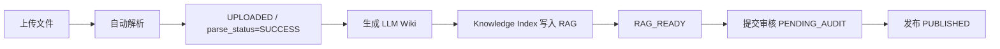

# 硅基猿猴俱乐部操作指导手册

> 面向业务人员和测试同学的第一版简明手册。当前内容以本地 Docker MVP 环境为准。

## 1. 系统入口

### 1.1 常用地址

| 用途 | 地址 | 说明 |
| --- | --- | --- |
| 硅基猿猴俱乐部管理台 | `http://localhost:3000` | Docker 静态资源容器入口，根路径会跳转到 `/m/silicon-ape-club-admin/` |
| 管理台后端 | `http://localhost:8080` | 知识资产、Wiki、AI 员工、权限、审计、通知等主入口 |
| Swagger UI | `http://localhost:8080/swagger-ui/index.html` | 后端接口调试入口 |
| OpenAPI JSON | `http://localhost:8080/v3/api-docs` | 接口定义 |
| Retrieval Service | `http://localhost:8090/api/retrieval/health` | RAG 检索服务健康检查 |
| Knowledge Runtime | `http://localhost:8091/health` | AI 员工运行时服务健康检查 |
| Task Memory | `http://localhost:8092/health` | 任务记忆服务健康检查 |
| Knowledge Pipeline Worker | `http://localhost:8093/health` | 独立知识流水线 Worker 健康检查 |
| MinIO 控制台 | `http://localhost:19001` | 对象存储控制台 |
| PostgreSQL | `localhost:15432` | 用户名/库名：`docspace` |

### 1.2 默认账号

| 角色 | 用户名 | 密码 | 说明 |
| --- | --- | --- | --- |
| 管理员 | `admin` 或 `zhangsan` | `Admin@123` | 具备管理、审核、发布、权限维护能力 |
| 普通成员 | `member` 或 `lisi` | `Member@123` | 具备普通文档查看、上传等能力 |

### 1.3 本地环境启动

在项目根目录执行：

```powershell
docker compose --profile app up -d
```

检查容器：

```powershell
docker compose --profile app ps
```

前端已纳入 Docker Compose，服务名为 `siliconapeclub-front`，容器名为 `sac-siliconapeclub-front`。如需重新构建前端静态镜像：

```powershell
cd siliconApeClub-admin\siliconApeClub-front
npm ci --registry=https://registry.npmmirror.com
npm run build:sit
cd ..\..
docker compose build siliconapeclub-front
docker compose --profile app up -d siliconapeclub-front
```

如需以前端开发模式单独启动：

```powershell
cd siliconApeClub-admin\siliconApeClub-front
npm run dev:sit
```

## 2. 文件管理生命周期

### 2.1 主流程



### 2.2 状态说明

| 阶段 | 业务动作 | 关键状态 | 主要数据表 |
| --- | --- | --- | --- |
| 上传 | 在管理台选择文件上传 | `status=PARSING` 或 `UPLOADED` | `ds_document`、`ds_document_version` |
| 解析 | 系统按文件类型调用解析引擎 | `parse_status=SUCCESS/FAILED` | `ds_parse_artifact`、`ds_document_audit` |
| 校正/重解析 | 人工修正文档解析内容，重新解析 | `parse_attempt_count` 增加 | `ds_document_version` |
| 生成 Wiki | 将解析内容转为 LLM Wiki | `ks_pipeline_job.status=completed` | `ks_pipeline_job`、`ks_wiki_page` |
| 写入 RAG | 生成 chunk、embedding、索引记录 | `ks_sync_job.status=completed` | `ks_chunk`、`ks_index_record` |
| 待审核 | 提交管理员审核 | `status=PENDING_AUDIT` | `ds_document_audit` |
| 发布 | 管理员审核发布 | `status=PUBLISHED` | `ds_document` |
| 驳回 | 管理员驳回 | `status=REJECTED` | `ds_document_audit` |
| 修订 | 从已发布文档创建新草稿 | 新文档 `status=RAG_READY` | `ds_document`、`ds_document_version` |
| 锁定 | 禁止继续编辑当前版本 | `status=LOCKED` | `ds_document` |

### 2.3 管理台上传到 LLM Wiki 的验证路径

1. 登录硅基猿猴俱乐部管理台。
2. 上传 `docx/pdf/pptx` 等已配置解析引擎的文件。
3. 在文档列表确认解析成功：`parse_status=SUCCESS`。
4. 调用知识流水线，将文档生成 LLM Wiki：

```http
POST http://localhost:8093/api/pipeline/documents/{documentId}/to-wiki
Content-Type: application/json

{
  "publish": true,
  "actorId": 1,
  "actorName": "张三"
}
```

也可以走后端合并入口：

```http
POST http://localhost:8080/api/knowledge-pipeline/documents/{documentId}/to-wiki
Authorization: Bearer <登录后 token>
```

5. 验证 Wiki 已生成并同步 RAG：

- `ks_pipeline_job.status=completed`
- `ks_wiki_page.status=active`
- `ks_wiki_page.sync_status=indexed`
- `ks_sync_job.status=completed`
- `ks_chunk.knowledge_status=active`

### 2.4 AI 员工配置与 RAG 管理闭环

1. 在管理台进入 `AI 员工配置`，可新建或编辑 AI 员工的编码、名称、描述、部门、岗位和启停状态。
2. 在同一页面勾选岗位知识，保存后会写入 AI 员工与岗位知识绑定关系。岗位知识由 `Wiki 中心` 的页面组成，不单独复制知识正文。
3. 文档点击 `同步 RAG` 后，会直接写入 `ks_chunk`、`ks_index_record`、`ks_sync_job`；文档生成并发布 Wiki 后，也会同步写入同一套 RAG 索引账本。
4. 进入 `RAG 管理台`，先选择 AI 员工，系统会自动带出该员工的 `actorId`、部门和岗位编码。
5. `索引 Chunk 治理` 会展示最近 active chunk。点击其中一条可直接把标题/预览带入检索问题，用于验证新入库文档或 Wiki 是否已可被 RAG 召回。
6. 在 `RAG 管理台` 可以查看和维护 `ks_acl_policy`、`ks_acl_binding`，也可以调整 chunk 的 ACL 策略、部门标签、岗位标签、密级和知识状态。
7. RAG 管理台请求从管理台后端 `http://localhost:8080/api/retrieval/debug` 代理到 retrieval-service，业务测试不需要直连 `8090`。

### 2.5 Wiki 中心与岗位知识管理

1. `Wiki 中心` 负责 Wiki 页面增删改查、发布同步 RAG、归档和删除。
2. `岗位知识管理` 基于 Wiki 页面勾选岗位知识范围，支持草稿、提交审核、审核通过、驳回、归档和删除。
3. AI 员工绑定的是岗位知识对象；运行时再从岗位知识对象读取 Wiki 页面集合、必读标记和默认检索范围。

### 2.6 Wiki 中心结构化工作台

1. 进入 `Wiki 中心` 后，页面分为三栏：左侧结构分组树、中间 Wiki 页面列表、右侧详情和知识图谱关系。
2. 左侧默认按 `部门 / 类型 / 状态` 聚合，也可切换为 `类型 / 状态`。点击任意分组后，页面列表会按该分组过滤。
3. 页面列表展示标题、页面类型、部门、状态、RAG 同步状态、ACL 策略、关系数量、版本和更新时间。搜索框、状态下拉和结构分组可以组合使用。
4. 右侧详情区可以编辑 Wiki 标题、类型、部门、ACL 策略、摘要和正文；发布后会继续触发 RAG 同步账本，不改变原有发布、归档、删除流程。
5. 权限卡片展示 ACL 策略名称、密级和绑定数量，点击后可进入 `RAG 管理台` 查看或维护 `ks_acl_policy`、`ks_acl_binding`。
6. 知识图谱关系区展示当前 Wiki 的入向/出向关系，可新增或删除关系。当前支持 `references`、`depends_on`、`related_to`、`supersedes`、`duplicated_with` 五类关系。

## 3. 权限说明

### 3.1 权限层级

| 层级 | 说明 | 主要数据表 |
| --- | --- | --- |
| 登录鉴权 | 用户登录后获得 JWT Token | `sys_user` |
| 角色权限 | 控制菜单、按钮、管理动作 | `sys_role`、`sys_menu`、`sys_role_permission` |
| 目录权限 | 控制目录下文件的默认访问能力 | `ds_folder_permission` |
| 文档权限 | 控制单个文档的查看、编辑、删除等能力 | `ds_document_permission` |
| 知识权限 | 控制 Wiki/RAG chunk 是否能被人或 AI 员工使用 | `ks_acl_policy`、`ks_acl_binding`、`ks_chunk` |
| 审计追踪 | 记录关键动作和执行结果 | `ds_document_audit`、`ks_audit_trace` |

### 3.2 常见权限动作

| 权限动作 | 说明 |
| --- | --- |
| `view` | 查看文件、目录、详情、预览 |
| `upload` | 上传文件 |
| `edit` | 编辑文档元数据或修正解析内容 |
| `delete` | 删除文件或目录 |
| `manage` | 管理目录或文档权限 |
| `correct` | 修正解析结果 |
| `push_rag` | 推送或触发 RAG 同步 |
| `request_audit` | 提交审核 |
| `publish` | 审核发布 |
| `reject` | 审核驳回 |
| `create_revision` | 创建修订版本 |
| `lock` | 锁定版本 |

### 3.3 RAG 权限命中

RAG 检索不是只看文本相似度，还会做权限过滤。

常见命中原因：

- `department`：用户或 AI 员工所在部门与 chunk 的 `department_tags` 匹配。
- `policy`：ACL 策略允许当前角色或 AI 岗位使用。
- `permission_error`：权限检查失败，通常需要看 `siliconApeClub-server` 日志。

可在 `ks_citation_log.permission_matched_by` 中查看检索结果为何被允许使用。

## 4. 数据库 Check

### 4.1 连接数据库

```powershell
docker exec -it sac-postgres psql -U docspace -d docspace
```

或单次执行：

```powershell
docker exec sac-postgres psql -U docspace -d docspace -c "SELECT now();"
```

### 4.2 迁移是否成功

```sql
SELECT version, description, success
FROM flyway_schema_history
ORDER BY installed_rank;
```

期望看到 V1-V6 均为 `success=true`。

### 4.3 文档上传与解析

```sql
SELECT id, name, status, parse_status, parse_engine,
       current_version, created_at, updated_at
FROM ds_document
WHERE deleted = 0
ORDER BY id DESC
LIMIT 10;
```

查看版本与解析内容：

```sql
SELECT document_id, version, source_file_name,
       left(parsed_content, 120) AS parsed_preview,
       created_at
FROM ds_document_version
ORDER BY id DESC
LIMIT 10;
```

### 4.4 Pipeline 与 Wiki

```sql
SELECT id, job_type, source_type, source_id, target_type, target_id,
       status, error_message, created_at, finished_at
FROM ks_pipeline_job
ORDER BY id DESC
LIMIT 10;
```

```sql
SELECT id, title, page_type, status, sync_status,
       department_id, current_version, created_at, updated_at
FROM ks_wiki_page
WHERE deleted = 0
ORDER BY id DESC
LIMIT 10;
```

查看 Wiki 页面关系：

```sql
SELECT r.id, r.source_page_id, s.title AS source_title,
       r.target_page_id, t.title AS target_title,
       r.relation_type, r.created_at
FROM ks_wiki_relation r
LEFT JOIN ks_wiki_page s ON s.id = r.source_page_id
LEFT JOIN ks_wiki_page t ON t.id = r.target_page_id
ORDER BY r.id DESC
LIMIT 20;
```

查看 Wiki 页面绑定的 ACL 策略和关系数量：

```sql
SELECT p.id, p.title, p.page_type, p.status, p.sync_status,
       a.policy_name, a.security_level,
       (SELECT COUNT(1) FROM ks_acl_binding b WHERE b.policy_id = p.acl_policy_id) AS acl_binding_count,
       (SELECT COUNT(1) FROM ks_wiki_relation r WHERE r.source_page_id = p.id OR r.target_page_id = p.id) AS relation_count
FROM ks_wiki_page p
LEFT JOIN ks_acl_policy a ON a.id = p.acl_policy_id
WHERE p.deleted = 0
ORDER BY p.updated_at DESC
LIMIT 20;
```

### 4.5 RAG 索引

```sql
SELECT id, source_type, source_id, source_version,
       status, attempt_count, error_message,
       created_at, finished_at
FROM ks_sync_job
ORDER BY id DESC
LIMIT 10;
```

```sql
SELECT id, wiki_page_id, knowledge_status,
       acl_policy_id, security_level, department_tags, position_tags,
       left(chunk_text, 120) AS preview
FROM ks_chunk
ORDER BY id DESC
LIMIT 10;
```

```sql
SELECT id, source_type, source_id, wiki_page_id,
       chunk_count, index_status, indexed_at
FROM ks_index_record
ORDER BY id DESC
LIMIT 10;
```

查看 RAG 权限策略与授权绑定：

```sql
SELECT id, policy_name, security_level, acl_version, status,
       created_at, updated_at
FROM ks_acl_policy
ORDER BY id DESC
LIMIT 10;
```

```sql
SELECT id, policy_id, principal_type, principal_id, action, effect, created_at
FROM ks_acl_binding
ORDER BY id DESC
LIMIT 20;
```

查看岗位知识与 Wiki 绑定：

```sql
SELECT id, code, name, position_code, status, updated_at
FROM ks_position_package
WHERE status <> 'deleted'
ORDER BY id DESC
LIMIT 10;
```

```sql
SELECT i.package_id, i.item_type, i.item_id, i.required, i.sort_order,
       p.title AS wiki_title, p.status AS wiki_status
FROM ks_position_package_item i
LEFT JOIN ks_wiki_page p ON p.id = i.item_id AND i.item_type = 'wiki_page'
ORDER BY i.package_id DESC, i.sort_order ASC
LIMIT 20;
```

### 4.6 权限与审计

```sql
SELECT document_id, user_id, role_code, permissions_json, inherited_from
FROM ds_document_permission
ORDER BY document_id DESC, user_id ASC
LIMIT 20;
```

```sql
SELECT trace_id, actor_type, actor_id, action,
       target_type, target_id, result_status, created_at
FROM ks_audit_trace
ORDER BY id DESC
LIMIT 10;
```

```sql
SELECT recipient_type, recipient_id, severity,
       title, read_at, created_at
FROM ks_notification
ORDER BY id DESC
LIMIT 10;
```

### 4.7 RAG 引用日志

```sql
SELECT trace_id, actor_type, actor_id, query_text,
       chunk_id, wiki_page_id, score, rerank_score,
       permission_matched_by, created_at
FROM ks_citation_log
ORDER BY id DESC
LIMIT 10;
```

## 5. 测试建议

### 5.1 冒烟检查

```powershell
curl http://localhost:8080/v3/api-docs
curl http://localhost:8090/api/retrieval/health
curl http://localhost:8091/health
curl http://localhost:8092/health
curl http://localhost:8093/health
```

### 5.2 业务验收清单

| 检查项 | 期望结果 |
| --- | --- |
| 管理员可登录 | `admin/Admin@123` 登录成功 |
| 普通成员可登录 | `member/Member@123` 登录成功 |
| 文件可上传 | 文档列表出现新文件 |
| 文件可解析 | `parse_status=SUCCESS` |
| 文件可生成 Wiki | `ks_pipeline_job.status=completed` |
| Wiki 可索引 | `ks_wiki_page.sync_status=indexed` |
| RAG 可召回 | 检索结果包含目标 Wiki 的 chunk |
| 权限可生效 | 无权限用户不能查看/删除受限文档 |
| 审计可追踪 | `ds_document_audit` 或 `ks_audit_trace` 有记录 |
| 通知可查询 | `ks_notification` 有成功或失败通知 |

## 6. 常见问题定位

| 现象 | 优先检查 |
| --- | --- |
| 页面打不开 | 前端是否启动、后端 `8080` 是否可访问 |
| 登录失败 | 账号密码、`sys_user.enabled`、后端日志 |
| 上传后不解析 | 文件类型是否有解析引擎绑定，查看 `parse_status` 与 `parse_error_message` |
| 生成 Wiki 失败 | 查看 `ks_pipeline_job.error_message`、`sac-knowledge-pipeline-worker` 日志 |
| RAG 查不到 | 查看 `ks_sync_job`、`ks_chunk.knowledge_status`、权限标签 |
| 权限不符合预期 | 查看 `ds_folder_permission`、`ds_document_permission`、`sys_role_permission` |
| 数据库表不存在 | 查看 `flyway_schema_history`，确认迁移是否成功 |

查看日志示例：

```powershell
docker logs --tail 100 sac-siliconapeclub-server
docker logs --tail 100 sac-knowledge-pipeline-worker
docker logs --tail 100 sac-retrieval-service
```
