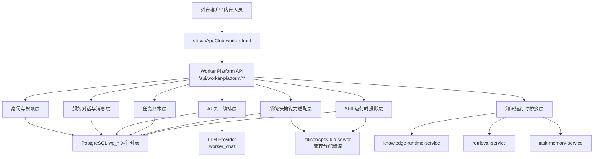
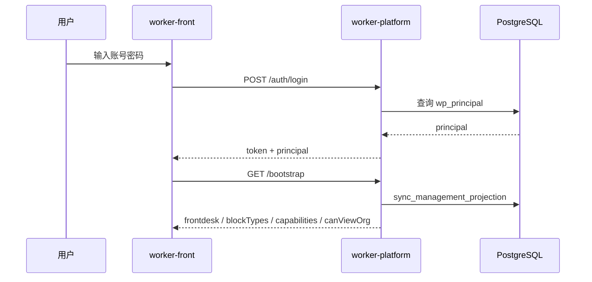
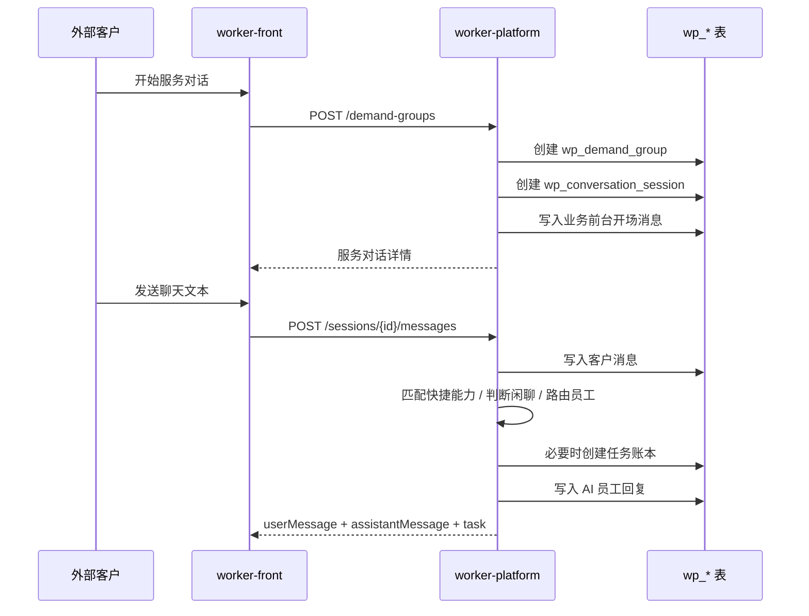
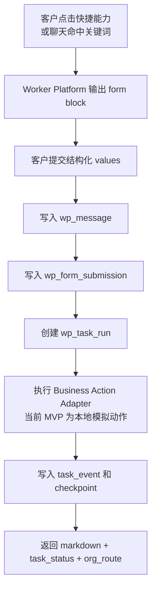

# siliconApeClub-worker-platform 架构与设计说明

版本：v0.1  
日期：2026-06-29  
定位：硅基猿猴俱乐部 AI 员工工作核心平台设计基线

## 1. 平台定位

`siliconApeClub-worker-platform` 是硅基猿猴俱乐部 AI 员工公司的运行时核心。它不是后台管理系统，也不是单纯聊天服务，而是客户、内部人员、AI 员工组织、任务账本、知识运行时和业务系统之间的统一工作平台。

管理台负责“治理和配置”，Worker Platform 负责“调用、编排和交付”。

```text
管理台 siliconApeClub-admin
  管组织、管知识、管权限、管技能、管模型、管客户可见性
        ↓ 投影 / 查询 / 内部调用
Worker Platform
  接客户、建会话、派员工、建任务、调知识、调技能、记账本、发起沉淀
        ↓
AI 员工服务台 siliconApeClub-worker-front
  客户和内部人员唯一客户端入口
```

平台必须坚持一个边界：

> 浏览器永远只访问 `siliconApeClub-worker-platform` 的 `/api/worker-platform/**`。Knowledge Runtime、Task Memory、Retrieval、管理台后端和模型服务都是服务端内部依赖，不暴露给客户端。

## 2. 核心使命

Worker Platform 的使命是让 AI 员工像一个真实组织一样工作。

它需要承担以下职责：

- 登录鉴权：识别外部客户、内部人员、管理员和未来 AI 员工身份。
- 服务对话：按客户和历史服务对话归档聊天、任务、产出物和知识沉淀候选。
- 业务前台：外部客户默认由业务前台 AI 员工接待、澄清、分派。
- 组织派发：根据组织关系、岗位、技能、客户权限和任务内容选择承接员工。
- 员工直通：内部人员或授权客户可咨询、直派授权范围内的 AI 员工。
- 多模态消息：支持 Markdown、HTML、表单、附件、任务状态、组织路由、员工卡片和交接记录。
- 系统快捷能力：承接管理台配置的对客业务表单和确定性业务动作。
- 任务账本：建立任务、事件、checkpoint、恢复、取消、转派、审核记录。
- Skill 加载：从管理台技能仓库投影审核通过的员工技能和绑定关系。
- 模型调用：按管理台 AI 模型配置调用 `worker_chat` 模型并记录 fallback 状态。
- 知识调用：服务端内部调用 Knowledge Runtime、Retrieval 和 Task Memory。
- 知识沉淀：任务结论进入候选 Wiki 或 Skill proposal，经管理台审核后成为正式资产。

## 3. 总体架构



当前 MVP 中，`siliconApeClub-worker-platform/app/main.py` 仍是集中式实现，包含 API、建表、种子数据、投影同步、业务动作、消息生成和模型调用。文档中的逻辑分层是目标架构边界，后续应逐步拆分为模块。

## 4. 当前工程结构

```text
siliconApeClub-worker-platform/
  Dockerfile
  README.md
  requirements.txt
  app/
    __init__.py
    config.py
    db.py
    main.py
    models.py
```

当前职责分布：

| 文件 | 当前职责 |
| --- | --- |
| `app/config.py` | 环境变量、PostgreSQL DSN、内部服务地址、token 配置 |
| `app/db.py` | psycopg 连接工厂 |
| `app/models.py` | FastAPI 请求模型和消息 block 类型 |
| `app/main.py` | API 路由、建表、种子、管理台投影、权限、会话、任务、快捷能力、模型调用 |
| `Dockerfile` | Python 3.11 FastAPI 镜像构建 |

当前部署端口：

| 服务 | 容器 | 端口 |
| --- | --- | --- |
| Worker Platform API | `sac-siliconapeclub-worker-platform` | `3010:3010` |
| Worker Front | `sac-siliconapeclub-worker-front` | `3011:80` |

## 5. 逻辑分层设计

### 5.1 Client Boundary 层

客户端只关心一个入口：

```http
/api/worker-platform/**
```

客户端不应直接访问：

- 管理台后端
- Knowledge Runtime
- Task Memory
- Retrieval
- 模型供应商 API
- 数据库

这样做的原因是：

- 权限统一由 Worker Platform 判断。
- 运行时上下文统一由 Worker Platform 装配。
- 任务账本和消息归档不会被绕过。
- 内部服务可以迭代而不影响客户端协议。

### 5.2 Identity & Access 层

当前身份类型：

| 类型 | 说明 |
| --- | --- |
| `external_customer` | 外部客户，只能访问自己的服务对话、任务和授权员工 |
| `internal_user` | 内部人员，可查看授权组织和员工，可咨询或派活 |
| `admin` | 管理员，拥有完整组织视图和员工操作权限 |
| `ai_employee` | 预留 AI 员工自身身份，后续用于员工自治调用 |

当前认证方式：

- 登录接口校验 `wp_principal.password_hash`。
- token 由 HMAC 签名，包含 `sub`、`typ`、`exp`。
- 所有运行期接口通过 Bearer token 加载 principal。

关键原则：

- 外部客户默认不能查看完整组织树。
- 外部客户只能访问自己的服务对话和任务。
- 员工咨询需要 `consult_employee`。
- 员工派活需要 `assign_employee`。
- 客户可见员工由客户角色默认规则和会员附加规则共同决定。

### 5.3 Conversation 层

服务对话是客户端的基本工作单位。

当前后端表名仍为 `wp_demand_group`，但前台不展示“需求登记”等概念。它是内部归档结构，用于聚合：

- 会话
- 消息
- 任务
- 参与员工
- 产出物
- 表单提交
- 候选 Wiki

会话由 `wp_conversation_session` 承载，消息由 `wp_message` 承载。消息不是纯文本，而是 typed block。

当前支持的 block 类型：

| 类型 | 用途 |
| --- | --- |
| `markdown` | 默认文本输出 |
| `html` | 受控展示，不作为关键业务入参 |
| `code` | 代码片段 |
| `image` | 图片展示 |
| `form` | 精准结构化输入 |
| `artifact` | PDF、Word、图片等产出物 |
| `task_status` | 任务状态和 checkpoint |
| `org_route` | 组织派发路径 |
| `employee_card` | 接手员工信息 |
| `handoff` | 任务交接记录 |

### 5.4 Frontdesk & Orchestration 层

业务前台是外部客户的默认入口。

当前默认前台员工：

```text
业务前台 Ada / frontdesk-ada
```

前台负责：

- 接待客户。
- 识别是否为确定性业务动作。
- 需要精准入参时输出表单。
- 非确定性事项建立任务账本。
- 根据内容选择承接员工。
- 输出组织路由和任务状态。

当前路由策略仍是 MVP 规则：

- 战略、规划、商业模式类关键词路由到战略员工。
- 市场、增长、客户类关键词路由到市场/客服员工。
- 技术、研发、接口、架构类关键词路由到研发员工。
- RAG、知识、Wiki 类问题路由到知识或 RAG 支持员工。
- 默认路由到通用交付或业务前台。

目标状态应升级为可配置路由策略：

- 基于组织职责。
- 基于岗位知识包。
- 基于员工技能。
- 基于客户权限。
- 基于任务 SLA。
- 基于历史成功率和成本。

### 5.5 Quick Capability 层

系统快捷能力是“业务系统对客接口”，不是 AI 员工 Skill。

权威配置源在管理台：

- `client_quick_capability_group`
- `client_quick_capability`

Worker Platform 负责投影给客户端：

```http
GET /api/worker-platform/quick-capabilities
POST /api/worker-platform/sessions/{sessionId}/quick-capabilities/{capabilityCode}/open
```

快捷能力包含：

- 分组
- 名称
- 描述
- 表单 Schema
- 展示 HTML
- 关键词
- 交易系统服务编码
- 动作码
- 外部/内部可见性
- 启停与排序

当前表单提交流程：

```text
客户点击快捷能力或聊天命中关键词
  -> Worker Platform 输出 form block
  -> 客户提交 values
  -> 写入 wp_form_submission
  -> 按 transactionServiceCode + actionCode 执行业务动作
  -> 写入 wp_task_run / wp_task_event / wp_task_checkpoint
  -> 返回 task_status + org_route
```

当前 MVP 内置确定性动作：

| actionCode | 行为 |
| --- | --- |
| `create_order` | 创建演示订单号 |
| `query_order_status` | 返回演示订单状态 |
| `return_request` | 创建演示退货申请 |
| `query_service_address` | 返回演示服务地址 |

目标状态应替换为业务动作适配器：

```text
BusinessActionAdapter
  route(transactionServiceCode, actionCode)
  validate(values)
  execute(values, context)
  normalizeResult()
  writeAudit()
```

### 5.6 Task Ledger 层

任务账本是 Worker Platform 的事实源。

核心表：

- `wp_task_run`
- `wp_task_event`
- `wp_task_checkpoint`
- `wp_collaboration_thread`

任务必须支持：

- 创建
- 分派
- 执行中
- checkpoint
- 恢复
- 取消
- 转派
- 审核
- 完成
- 进入知识沉淀

当前任务状态：

| 状态 | 说明 |
| --- | --- |
| `queued` | 已建账，未明确员工执行 |
| `running` | 已进入执行 |
| `completed` | 已完成 |
| `cancelled` | 已取消 |
| `needs_changes` | 审核后需要修改 |

任务创建时会写入初始 checkpoint：

```json
{
  "stage": "task_created",
  "recoverable": true,
  "nextAction": "load_employee_context_and_execute"
}
```

这代表长任务恢复的基本设计：服务重启后，不依赖内存，而依赖任务账本和 checkpoint 恢复。

### 5.7 Skill Runtime 层

AI 员工 Skill 的权威配置源在管理台技能仓库：

- `hr_skill_repository`
- `hr_skill_binding`

Worker Platform 启动或 bootstrap 时，将审核通过且启用的技能投影到：

- `wp_worker_skill`
- `wp_skill_binding`

Skill 设计原则：

- Skill 面向员工执行能力、工具能力、岗位能力。
- 对客快捷能力不属于 Skill。
- AI 员工总结出来的 Skill 不能直接启用。
- Skill proposal 必须进入管理台审核。
- 高级 Skill 只能由顶级管理权限维护或审核。

当前 proposal 流程：

```text
内部人员 / AI 员工发现可复用能力
  -> POST /api/worker-platform/skills/proposals
  -> 写入 hr_skill_repository
  -> review_status = pending_review
  -> enabled = 0
  -> 管理台审核
  -> 审核通过后下次投影进入 wp_worker_skill
```

### 5.8 Knowledge Bridge 层

Worker Platform 是知识服务的服务端入口。目标上，它应在任务启动和执行过程中调用：

- `knowledge-runtime-service`：加载 AI 员工 runtime context、岗位知识、must-read Wiki、默认检索范围。
- `retrieval-service`：按员工身份和任务上下文执行 RAG 检索。
- `task-memory-service`：记录任务目标、检索 query、引用、输出、反馈和沉淀候选。
- 管理台后端：查询配置、提交候选 Wiki、提交 Skill proposal。

当前 MVP 已经预留内部服务地址，并实现 `wp_wiki_candidate` 本地候选表。下一阶段应将本地候选与 `knowledge-runtime-service` / 管理台 Wiki proposal 流程打通。

目标任务执行上下文：

```text
principal
  客户或内部人员身份
employee
  AI 员工身份、部门、岗位、技能、模型配置
task
  目标、上下文、SLA、状态、checkpoint
knowledgeScope
  岗位知识、Wiki 页面、RAG 范围、权限版本
memory
  历史任务、已引用知识、人类反馈
```

### 5.9 AI Model Invocation 层

Worker Platform 聊天分析使用管理台 `sys_ai_model_profile` 中 `purpose=worker_chat` 的模型配置。

调用原则：

- 模型配置权威源在管理台系统设置。
- Worker Platform 不硬编码供应商。
- 模型调用结果 metadata 必须记录到 message block。
- 未配置 key 或调用失败时可以 fallback，但必须显式标记。

当前 metadata 结构包含：

- `purpose`
- `profileCode`
- `provider`
- `modelName`
- `realCall`
- `fallbackUsed`
- `fallbackReason`

## 6. 核心数据模型

### 6.1 身份与客户

| 表 | 说明 |
| --- | --- |
| `wp_principal` | Worker Platform 登录主体 |
| `wp_customer_profile` | 外部客户资料 |

### 6.2 组织与员工

| 表 | 说明 |
| --- | --- |
| `wp_org_unit` | 公司、部门、团队等组织单元 |
| `wp_ai_employee` | AI 员工运行时投影 |
| `wp_org_relation` | 员工之间的上下级、协作、路由关系 |
| `wp_employee_permission` | 主体对员工的咨询、派活权限 |

### 6.3 服务对话

| 表 | 说明 |
| --- | --- |
| `wp_demand_group` | 内部服务对话归档和任务聚合结构 |
| `wp_conversation_session` | 一段连续聊天会话 |
| `wp_message` | typed block 消息记录 |
| `wp_output_artifact` | 产出物附件 |

### 6.4 任务账本

| 表 | 说明 |
| --- | --- |
| `wp_task_run` | 任务主账本 |
| `wp_task_event` | 任务事件流 |
| `wp_task_checkpoint` | 任务恢复点 |
| `wp_collaboration_thread` | 协作、转派、交接记录 |

### 6.5 技能与沉淀

| 表 | 说明 |
| --- | --- |
| `wp_worker_skill` | 已投影到运行期的员工技能 |
| `wp_skill_binding` | 员工与技能绑定 |
| `wp_form_submission` | 客户表单提交记录 |
| `wp_wiki_candidate` | 任务结论沉淀出的候选 Wiki |

## 7. API 契约

### 7.1 健康与启动

```http
GET /health
GET /
```

### 7.2 鉴权

```http
POST /api/worker-platform/auth/login
GET  /api/worker-platform/auth/me
POST /api/worker-platform/auth/logout
GET  /api/worker-platform/bootstrap
```

### 7.3 系统快捷能力

```http
GET  /api/worker-platform/quick-capabilities
POST /api/worker-platform/sessions/{sessionId}/quick-capabilities/{capabilityCode}/open
```

兼容旧路径：

```http
GET  /api/worker-platform/capabilities
POST /api/worker-platform/sessions/{sessionId}/capabilities/{capabilityCode}/open
```

### 7.4 服务对话与消息

```http
GET  /api/worker-platform/demand-groups
POST /api/worker-platform/demand-groups
GET  /api/worker-platform/demand-groups/{groupId}
GET  /api/worker-platform/demand-groups/{groupId}/sessions
POST /api/worker-platform/demand-groups/{groupId}/sessions
GET  /api/worker-platform/sessions/{sessionId}/messages
POST /api/worker-platform/sessions/{sessionId}/messages
```

### 7.5 组织与员工

```http
GET  /api/worker-platform/org/tree
GET  /api/worker-platform/org/employees
GET  /api/worker-platform/org/employees/{employeeId}
GET  /api/worker-platform/org/employees/{employeeId}/skills
POST /api/worker-platform/org/employees/{employeeId}/consult
POST /api/worker-platform/org/employees/{employeeId}/assign
```

### 7.6 任务

```http
GET  /api/worker-platform/tasks
POST /api/worker-platform/tasks
GET  /api/worker-platform/tasks/{taskId}
POST /api/worker-platform/tasks/{taskId}/resume
POST /api/worker-platform/tasks/{taskId}/cancel
POST /api/worker-platform/tasks/{taskId}/handoff
POST /api/worker-platform/tasks/{taskId}/review
```

### 7.7 技能与知识沉淀

```http
GET  /api/worker-platform/skills
POST /api/worker-platform/skills/proposals
POST /api/worker-platform/capabilities/proposals
POST /api/worker-platform/wiki-candidates
```

## 8. 核心流程

### 8.1 登录与启动流程



### 8.2 外部客户服务对话流程



### 8.3 确定性业务表单流程



### 8.4 业务前台组织派发流程

```text
客户自然语言输入
  -> 业务前台 Ada 接收
  -> 判断是否命中系统快捷能力
  -> 未命中则创建任务账本
  -> 依据关键词和员工职责选择 routeEmployee
  -> 调用 worker_chat 模型生成分析说明
  -> 输出组织派发路径、员工卡片、补充信息表单、任务状态
```

目标状态应补齐：

- 员工岗位知识包加载。
- 员工技能可用性判断。
- SLA 和成本约束。
- 任务成功率路由。
- 人类接管条件。

### 8.5 员工直通流程

```text
用户查看员工直通
  -> Worker Platform 根据 principal 权限返回可见员工
  -> 用户发起咨询或派活
  -> 平台校验 consult_employee / assign_employee
  -> 咨询：创建会话并返回员工建议
  -> 派活：创建任务账本并分配给目标员工
```

### 8.6 长任务恢复流程

```text
任务创建
  -> 写 wp_task_run
  -> 写 wp_task_event(created)
  -> 写 wp_task_checkpoint(created)
  -> 任务执行过程持续追加 event / checkpoint
  -> 服务重启
  -> 查询未完成任务
  -> 读取最新 checkpoint
  -> resume_task 将状态置为 running
  -> 继续执行或等待员工接手
```

当前已实现手动 resume API。后续应实现自动恢复扫描器：

```text
WorkerRecoveryScheduler
  find status in queued/running/needs_changes
  load latest checkpoint
  rebuild runtime context
  continue or mark waiting_human
```

### 8.7 Skill 沉淀流程

```text
任务执行中发现可复用动作
  -> 内部人员或 AI 员工提交 Skill Proposal
  -> Worker Platform 写入管理台 hr_skill_repository
  -> review_status = pending_review
  -> enabled = 0
  -> 管理台审核
  -> 审核通过
  -> Worker Platform 下次投影
  -> wp_worker_skill / wp_skill_binding 生效
```

### 8.8 Wiki 候选沉淀流程

```text
任务完成
  -> 识别可复用知识或流程变化
  -> POST /wiki-candidates
  -> 写入 wp_wiki_candidate
  -> task_event 记录 wiki_candidate_created
  -> 后续进入管理台 Wiki proposal 审核
  -> 发布后同步 RAG
```

## 9. 当前 MVP 能力与目标能力差异

| 领域 | 当前 MVP | 目标能力 |
| --- | --- | --- |
| 代码结构 | `main.py` 集中式实现 | 拆分 auth、conversation、orchestrator、task、capability、projection、knowledge 模块 |
| 路由策略 | 关键词规则 | 基于岗位、技能、知识包、SLA、成本和历史效果路由 |
| 业务动作 | 本地模拟动作 | 交易系统适配器，支持真实业务系统查询、提交、回写 |
| 长任务 | 任务账本 + 手动恢复 | 自动恢复调度、幂等执行、失败补偿 |
| 知识调用 | 内部服务地址已配置，候选 Wiki 本地落表 | 完整 runtime context、RAG 检索、task memory、citation log |
| 模型调用 | `worker_chat` 真实配置 + fallback | 多员工、多模型、多成本策略、调用配额和质量评估 |
| 权限 | principal + employee permission | 组织 ABAC、客户合同边界、任务级授权、知识级授权联动 |
| 报表 | 任务/表单数据可沉淀 | Token 成本、员工收益、任务 ROI、业务线收益报表 |

## 10. 后续工程化拆分建议

当前 `main.py` 已经超过单文件合理复杂度。后续建议按以下模块拆分：

```text
app/
  api/
    auth.py
    bootstrap.py
    conversations.py
    employees.py
    tasks.py
    capabilities.py
    skills.py
    wiki_candidates.py
  domain/
    identity.py
    conversation.py
    employee.py
    task.py
    message_block.py
    capability.py
    skill.py
  services/
    projection_service.py
    orchestrator_service.py
    task_ledger_service.py
    business_action_service.py
    model_service.py
    knowledge_bridge.py
    recovery_service.py
  repositories/
    principal_repository.py
    conversation_repository.py
    employee_repository.py
    task_repository.py
    capability_repository.py
  schemas/
    requests.py
    responses.py
  infra/
    db.py
    http_client.py
    security.py
    settings.py
```

拆分优先级：

1. `models.py` 拆成 request/response schema。
2. 建表与投影逻辑从 `main.py` 移出。
3. 消息处理和任务处理拆成 service。
4. 系统快捷能力与业务动作适配器独立。
5. Knowledge Runtime / Retrieval / Task Memory 客户端独立。
6. 引入 migration，而不是在应用启动时长期建表。

## 11. 关键设计原则

### 11.1 客户端只看服务，不看内部账本

前台展示“服务对话”，不展示内部的 `demand_group` 概念。后端可以保留内部表名，但产品语言必须面向客户和服务。

### 11.2 表单是精准输入，不是聊天的替代品

自然语言适合表达意图，表单适合提交精确业务参数。AI 员工应识别何时需要表单，而不是让客户一开始就面对登记表。

### 11.3 确定性业务动作不强制调用大模型

下单、查进度、退货、查询地址等业务动作应通过结构化表单和业务动作适配器完成。模型负责理解、解释、路由和异常处理，而不是替代所有业务接口。

### 11.4 任务账本是长任务事实源

任何可能跨时间、跨员工、跨服务恢复的工作都必须写入任务账本、事件和 checkpoint。内存状态不能作为事实源。

### 11.5 AI 员工不能绕过审核沉淀正式知识

AI 员工可以提交候选 Wiki 和 Skill proposal，但不能直接发布 active Wiki 或启用高级 Skill。

### 11.6 运行时投影不等于权威配置

Worker Platform 的 `wp_*` 表是运行时投影和账本。组织、员工、技能、客户可见性、系统快捷能力和模型配置的权威源在管理台。

### 11.7 fallback 必须可观测

模型调用失败或未配置 key 时允许 fallback，但必须在 message metadata、任务事件或调试信息中体现，不能伪装成真实模型调用成功。

## 12. 下一阶段建设重点

### 12.1 完整 AI 员工运行时上下文

任务启动时，平台应加载：

- 员工身份
- 部门和岗位
- 岗位知识对象
- must-read Wiki
- 默认 RAG scope
- 可用 Skill
- 任务历史记忆
- 客户身份和权限边界
- 模型 Profile

### 12.2 真实业务动作适配器

将当前本地模拟动作替换为可配置适配器：

- 服务编码
- 动作码
- 入参 Schema
- 出参 Schema
- 幂等键
- 超时和重试
- 审计日志
- 人类接管规则

### 12.3 自动任务执行器

当前任务创建后，主要返回给前端展示。后续应补齐后台执行器：

- 按任务类型选择执行策略。
- 调用员工 Skill。
- 调用知识检索。
- 写入 Task Memory。
- 更新进度。
- 失败自动进入人工接管。

### 12.4 经营报表基础

Worker Platform 是未来 AI 员工 ROI 报表的事实源之一，应逐步记录：

- Token 消耗
- 模型调用成本
- 任务耗时
- 员工耗时
- 业务动作成功率
- 客户转化
- 收入或收益归因
- 人类接管成本

### 12.5 自动知识沉淀闭环

补齐链路：

```text
wp_task_run
  -> task-memory-service
  -> wiki proposal
  -> 管理台审核
  -> active Wiki
  -> RAG 同步
  -> 后续任务引用
```

## 13. 结论

`siliconApeClub-worker-platform` 是硅基猿猴俱乐部从“知识管理平台”走向“全 AI 员工公司”的关键系统。

它的核心价值不是提供一个聊天 API，而是把客户入口、组织关系、员工权限、快捷能力、任务账本、Skill、模型调用、知识记忆和知识沉淀连接成一个可运行的 AI 员工组织。

后续所有 AI 员工能力都应围绕这个原则演进：

> 客户只进入 Worker Platform；AI 员工只在组织、权限、知识和任务账本约束下工作；所有产出都可追溯、可恢复、可沉淀、可度量。

