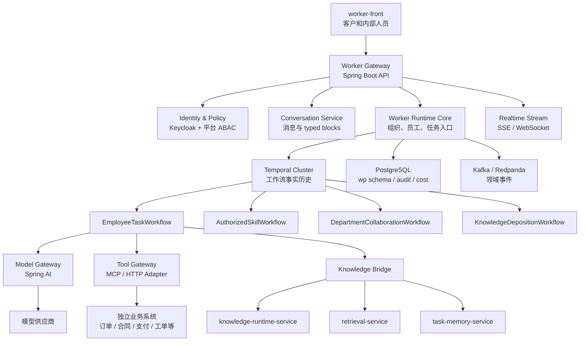
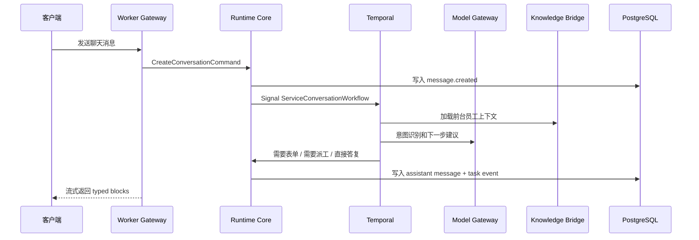
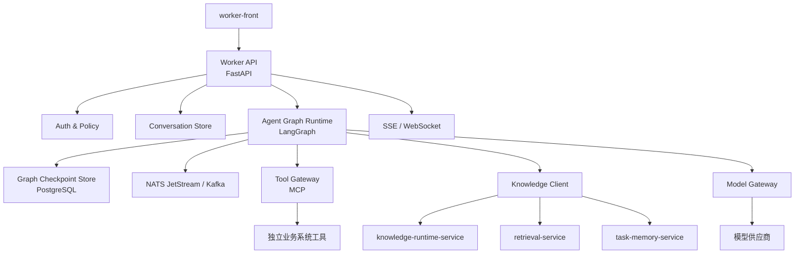
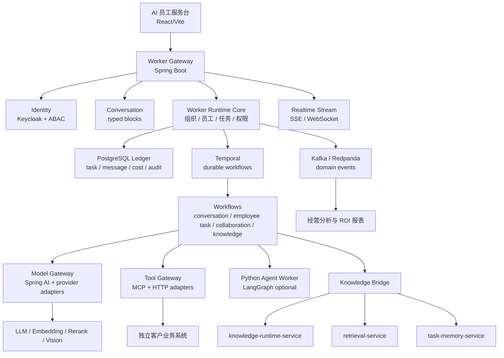

# siliconApeClub-worker-platform 下一代架构方案选型

版本：v0.4  
日期：2026-06-29  
定位：AI 员工平台下一阶段架构决策稿  

## 1. 结论先行

我认为当前 `siliconApeClub-worker-platform` 的方向是对的：客户端只访问 Worker Platform，由 Worker Platform 统一承接客户、会话、组织、员工、任务、知识、技能、模型和外部业务系统调用边界。

但当前实现还是 MVP 形态：FastAPI 单体、路由和运行时状态集中在 `main.py`、任务恢复主要依赖本地账本、AI 员工推理和外部业务系统调用还没有形成稳定的运行时内核。它适合验证产品闭环，不适合作为长期承载“全 AI 员工公司”的核心底座。

我给出两套比当前方案更好的目标架构：

| 方案 | 名称 | 核心判断 | 适合阶段 |
| --- | --- | --- | --- |
| 方案一 | 企业级可恢复工作流核心架构 | 把 Worker Platform 做成企业运行时，任务、权限、账本、组织协作和审计是第一性能力，AI 推理只是可替换执行器 | 推荐作为长期主架构 |
| 方案二 | AI 原生 Agent Graph 架构 | 把 AI 员工的推理、协作和工具调用建模为可持久化图，最大化 AI 能力迭代速度 | 适合作为创新型执行层或早期快速迭代 |

最终选型建议：

> 选择“方案一”为主架构：Java 21 / Spring Boot + Temporal + PostgreSQL + Kafka/Redpanda + Keycloak + OpenTelemetry。  
> 同时吸收“方案二”的优点：把 LangGraph 作为可插拔的 Python Agent Execution Worker，用于复杂员工推理、规划和多步工具调用，但不能让 LangGraph 成为组织账本、权限和任务事实源。

一句话：**核心平台要像银行核心系统一样可靠，AI 推理层要像实验室一样灵活。**

### 1.1 关键边界修正：硅基猿猴俱乐部不是业务系统

硅基猿猴俱乐部的产品定位是 **AI 员工组织**，不是订单、支付、合同、库存、信贷、客户主数据等业务系统。

业务系统必须完全独立部署、独立选型、独立数据库、独立运维、独立演进。业务系统的开发、测试、运维由科技部负责，但它的技术栈不应反向约束硅基猿猴俱乐部自身平台，也不应与 Worker Platform 共库、共模块或共发布。

AI 员工在对客时更像“客户代理”或“组织授权员工”：

- 客户向 AI 员工提出诉求。
- AI 员工理解诉求、澄清入参、选择被授权 Skill。
- Skill 在权限、客户授权、审计和幂等约束下，通过 Tool Gateway 调用外部业务系统。
- 订单、交易、合同、客户资料等业务事实仍然属于外部业务系统。
- Worker Platform 只记录 AI 员工做了什么、为什么做、凭什么权限做、调用了哪个 Skill、消耗多少成本、产生了什么客户可见结果。

因此，本选型中的 Tool Gateway、客户服务入口、Skill、外部业务系统动作等概念都必须按这个边界理解：

> Worker Platform 不是业务系统实现层，而是 AI 员工组织的运行时、授权层、调度层、审计层和客户交互层。

## 2. 当前方案的主要瓶颈

当前方案的价值在于快速打通了：

- 客户登录和服务对话。
- 客户服务入口配置（当前系统中命名为系统快捷能力）。
- 员工直通。
- 任务账本。
- Skill proposal。
- Wiki candidate。
- 模型配置调用。
- 管理台配置投影。

但如果把它作为长期核心，会遇到以下问题。

### 2.1 单体运行时承载过多职责

当前 `app/main.py` 同时包含：

- API 路由。
- 建表和种子数据。
- 登录鉴权。
- 会话和消息。
- 组织员工投影。
- 权限判断。
- 客户服务入口配置。
- 任务账本。
- 外部业务系统调用模拟。
- 模型调用。
- 知识沉淀。

这不是代码风格问题，而是架构边界问题。AI 员工平台越往后走，业务状态、组织状态、模型状态、工具状态、任务状态会不断叠加，如果没有明确运行时内核，后面会变成一个很难验证的大状态机。

### 2.2 长任务恢复能力还不够“系统级”

当前已经有 `wp_task_run`、`wp_task_event`、`wp_task_checkpoint`，这是正确方向。

但真正的 AI 员工任务会包括：

- 等用户补充表单。
- 等人工审核。
- 等业务系统回调。
- 等其他部门员工完成子任务。
- 工具调用失败重试。
- 模型调用超时重试。
- 服务重启后继续执行。
- 多天后继续执行。

这些不应该靠接口里手工 if/else 和状态字段堆出来，需要工作流引擎承接。

### 2.3 AI 推理和外部业务系统边界需要更硬

Worker Platform 同时面对两类动作：

- 确定性 Skill 调用：查订单、下单、退货、同步合同、创建工单等，这些动作最终发生在外部业务系统。
- AI 推理动作：理解意图、拆解任务、写文档、生成方案、总结知识。

这两类动作必须分离。确定性 Skill 调用要强校验、可审计、可重放、可幂等、可追溯到客户授权；AI 推理动作要可观测、可回退、可限制成本。

### 2.4 组织治理和权限不能只停留在接口判断

AI 员工公司不是多 Agent 聊天室。它必须有：

- 组织结构。
- 岗位职责。
- 员工权限。
- 客户可见性。
- 员工可咨询范围。
- 员工可派活范围。
- 知识可访问范围。
- 外部业务系统 Skill 可执行范围。
- 成本预算。
- 审核链路。

这些都应该进入统一 Policy / Runtime Context，而不是散落在多个接口里。

### 2.5 成本和收益账本还没有成为一等公民

硅基猿猴俱乐部的长期价值不是“能聊天”，而是让客户看到：

- 消耗了多少 Token。
- 调用了多少工具。
- 产生了多少任务。
- 交付了多少产出。
- 创造了多少收入或节省了多少成本。
- 哪些员工、部门、能力、客户是高 ROI。

因此 Worker Platform 必须从第一天就按经营账本思维设计，而不是只记录聊天。

## 3. 方案一：企业级可恢复工作流核心架构

### 3.1 架构定位

方案一把 `siliconApeClub-worker-platform` 定位为“AI 员工公司的企业核心运行时”。

它不追求把所有 AI 逻辑都写在一个 Agent 框架里，而是先把组织、权限、任务、账本、审计、成本、模型调用和外部业务系统授权调用边界稳定下来。

AI 员工的智能推理可以由 Spring AI、Python Agent Worker、LangGraph Worker 或模型供应商完成，但所有动作必须回到 Worker Platform 的运行时约束中。

### 3.2 技术栈选择

| 层级 | 推荐技术 | 选择理由 |
| --- | --- | --- |
| 主语言 | Java 21，必要时局部 Kotlin | 与现有管理台后端技术栈一致，适合复杂领域建模、事务、权限和长期维护 |
| Web 框架 | Spring Boot | 生态成熟，和管理台、认证、配置、观测、数据库集成顺畅 |
| AI 调用层 | Spring AI + 自研 Model Gateway | 在 JVM 内统一 chat、embedding、tool calling、重试、fallback、成本计量 |
| 长任务工作流 | Temporal | 用工作流历史承接多天任务、重试、恢复、人工等待、补偿和状态查询 |
| 数据库 | PostgreSQL | 作为 AI 员工组织运行时事实源，按 schema 拆分任务账本、配置投影、审计和经营指标 |
| 消息总线 | Kafka 或 Redpanda | 作为跨服务事件流，承接 task/event/outbox、知识沉淀、经营指标异步处理 |
| 鉴权 | Keycloak + 平台 ABAC | Keycloak 负责 OIDC、账号、角色；平台自研组织、客户、员工、知识和任务级授权 |
| 观测 | OpenTelemetry + Prometheus + Grafana | 对请求、工作流、模型调用、工具调用、Token 成本做全链路追踪 |
| 工具协议 | MCP + HTTP Adapter | 外部业务系统作为工具被统一注册、授权、审计、限流，可逐步接入外部工具生态 |
| 前端 | 继续 React/Vite，后续可升级为模块化工作台 | 当前前端不构成瓶颈，重点是稳定 typed block 协议和流式消息 |

### 3.3 核心服务拆分



### 3.4 服务职责设计

#### 3.4.1 Worker Gateway

对浏览器暴露唯一入口：

```http
/api/worker-platform/**
```

职责：

- 登录态校验。
- 会话入口。
- 消息发送。
- 客户服务入口打开。
- 员工直通。
- 任务查询。
- 流式输出。
- typed block 协议适配。

它不直接执行复杂长任务，只负责把客户动作转为运行时命令。

#### 3.4.2 Runtime Core

Worker Platform 的领域核心。

自研，不建议交给开源 Agent 框架。

职责：

- 组织关系解析。
- 员工可见性。
- 员工可咨询和可派活权限。
- 岗位知识包加载计划。
- 任务创建。
- 任务分派。
- 外部 Skill 调用建账。
- 员工执行上下文装配。
- 成本预算检查。
- 审核链判断。

核心对象：

- `Principal`
- `CustomerProfile`
- `ServiceConversation`
- `ConversationMessage`
- `AiEmployee`
- `OrgUnit`
- `EmployeeRelation`
- `EmployeeRuntimeContext`
- `TaskRun`
- `TaskEvent`
- `TaskCheckpoint`
- `WorkerSkill`
- `ClientServiceEntry`
- `AuthorizedSkillCall`
- `OutputArtifact`
- `CostLedger`
- `RevenueAttribution`

#### 3.4.3 Temporal Workflows

Temporal 用来承接“必须可靠恢复”的流程。

建议第一阶段定义 5 类工作流：

| Workflow | 职责 |
| --- | --- |
| `ServiceConversationWorkflow` | 管理一次服务对话的生命周期，包括意图识别、表单等待、任务创建 |
| `AuthorizedSkillWorkflow` | 执行被授权 Skill，如代表客户向外部业务系统下单、查询、退货、创建工单 |
| `EmployeeTaskWorkflow` | 执行 AI 员工任务，包括加载上下文、规划、工具调用、产出物生成 |
| `DepartmentCollaborationWorkflow` | 处理跨部门协作、转派、审核、会签 |
| `KnowledgeDepositionWorkflow` | 处理候选 Wiki、候选 Skill、审核和同步知识层 |

Temporal 的价值在于：

- 任务状态不依赖内存。
- 服务重启后可恢复。
- 失败可重试。
- 长时间等待可建模。
- 审核和回调可建模。
- 每一步执行历史可追溯。

#### 3.4.3.1 Leader 调度与员工协作机制

方案一必须把“组织协作”建模为平台能力，而不是让多个 Agent 在 prompt 里临时对话。

leader 的核心技能不是“把所有需求都拆给别人”，而是判断哪种执行策略对当前任务最合适。简单任务由 leader 直接完成，可以避免跨员工沟通成本；周期长、可并行、需要多岗位专精的任务才应拆分；某个组员的 Skill 或岗位知识明显更匹配时，应单独下发；高风险任务则需要 reviewer 或上级介入。

因此 leader 在生成 `TaskPlan` 前，应先生成 `ExecutionDecision`。

`ExecutionDecision` 支持的执行模式：

| executionMode | 说明 |
| --- | --- |
| `leader_self_execute` | leader 直接完成，不拆分、不下发，适合简单、短周期、上下文密集任务 |
| `single_delegate` | 下发给一个更合适的组员，适合某个岗位或 Skill 明显更匹配的任务 |
| `parallel_decompose` | 拆分多个子任务并行执行，适合周期长、可并行、跨岗位的复杂任务 |
| `sequential_decompose` | 拆分多个有依赖的子任务顺序执行 |
| `consult_then_execute` | 先咨询专精员工，leader 吸收意见后自己完成 |
| `escalate_or_review` | 任务高风险或高价值，需要上级、reviewer 或人工审核介入 |
| `clarify_before_plan` | 信息不足，先向客户或内部人员追问，再决定执行策略 |

决策依据：

- 任务复杂度。
- 预计周期。
- 是否可并行。
- 上下文传递损耗。
- leader 自身岗位和 Skill 匹配度。
- 组员岗位和 Skill 匹配度。
- 模型成本。
- 协作沟通成本。
- 质量收益。
- 客户 SLA。
- 风险等级。
- 员工当前负载。
- 是否需要外部业务系统 Skill。

平台要把这个决策显式入账，而不是藏在 prompt 里。`ExecutionDecision` 至少包含：

- 推荐执行模式。
- 决策理由。
- leader 自做成本估算。
- 委派成本估算。
- 并行收益估算。
- 预期质量收益。
- 预期沟通损耗。
- 候选员工和岗位匹配分。
- 风险和审核建议。

一个需要拆分的复杂任务应按真实公司协作方式运行：

```text
客户诉求
  -> 业务前台澄清
  -> 选择承接部门和 leader
  -> leader 识别目标、边界、风险、验收标准
  -> leader 生成 ExecutionDecision
  -> 简单任务 leader 直接完成
  -> 专精任务单独委派给最合适组员
  -> 复杂任务生成 TaskPlan 并拆分 WorkPacket
  -> Temporal 按执行模式自做、单派、并行或顺序执行
  -> 如有组员参与，则组员提交 WorkResult
  -> leader 逐项验收 ReviewRecord
  -> 不合格结果进入返工或转派
  -> 需要汇总时 leader 综合结果
  -> 必要时进入审核员工或人工审核
  -> 向客户输出最终 typed blocks / artifact
```

核心协作对象：

| 对象 | 含义 |
| --- | --- |
| `ExecutionDecision` | leader 对自做、单派、并行拆分、顺序拆分、咨询或升级的执行策略决策 |
| `TaskPlan` | leader 对总任务的执行计划，可以是不拆、自做、单派、并行拆分或顺序拆分 |
| `WorkPacket` | leader 下发给组员的结构化工作包，不是随意聊天消息 |
| `WorkResult` | 组员完成后的结构化回传，包含结论、证据、产出物、引用、风险和自检 |
| `ReviewRecord` | leader 对每个子任务的验收记录，支持通过、返工、拒绝、转派、升级 |
| `CollaborationThread` | leader、组员、审核员工之间的内部协作消息流 |

`WorkPacket` 至少包含：

- 总任务 ID 和子任务 ID。
- leader 身份、执行员工身份、所属部门。
- 任务目标。
- 背景上下文。
- 输入材料引用。
- 权限边界。
- 可用 Skill。
- 可用知识范围。
- 输出契约。
- 验收标准。
- 成本预算。
- 截止时间。
- 依赖任务。
- 返工策略。

`WorkResult` 至少包含：

- 子任务结论。
- 关键产出。
- 产出物引用。
- 使用的知识引用。
- 调用的 Skill 和工具证据。
- 未解决问题。
- 风险提示。
- 自检结果。
- Token 和工具成本。
- 建议沉淀的 Wiki 或 Skill。

leader 的验收不是简单等待所有组员返回，而是执行三层检查：

1. 结构验收：是否满足输出契约、字段、附件和格式。
2. 证据验收：是否有引用、工具调用证据、业务系统回执或知识来源。
3. 质量验收：是否满足目标、约束、风险和客户验收标准。

当 ExecutionDecision 选择 `parallel_decompose`，例如 3 个组员并行完成子任务时，leader 不能直接拼接结果，而要：

- 对每个 `WorkResult` 生成 `ReviewRecord`。
- 对未通过的结果发起 `ReworkSignal`。
- 对冲突结果发起 `ConflictResolutionActivity`。
- 对缺失信息发起 `ClarificationRequest`，必要时由业务前台询问客户。
- 对全部通过的结果执行 `SynthesisActivity`。
- 综合生成最终客户回复、内部总结、产出物和知识沉淀候选。

Temporal 上建议拆成：

| Workflow / Activity | 职责 |
| --- | --- |
| `LeaderTaskWorkflow` | 总任务 owner，负责执行策略决策、直接执行、拆解、派发、验收、汇总和最终交付 |
| `SubTaskWorkflow` | 单个组员执行子任务，支持阻塞、追问、工具调用、提交结果 |
| `DecideExecutionStrategyActivity` | leader 结合成本、效率、质量、风险和岗位匹配度选择执行模式 |
| `PlanTaskActivity` | leader 结合组织、岗位、Skill、知识和模型生成 TaskPlan |
| `ValidateTaskPlanActivity` | 平台校验计划是否越权、超预算、员工不可用或依赖错误 |
| `DispatchWorkPacketActivity` | 写入 WorkPacket 并启动子任务 workflow |
| `ExecuteLeaderSelfActivity` | leader 自己直接完成简单任务 |
| `ReviewWorkResultActivity` | leader 验收组员结果 |
| `SynthesisActivity` | leader 综合已验收结果，生成最终答复和产出物 |

内部员工之间的信息传输不依赖前端聊天框，而依赖持久化协作事件：

- `TASK_PLANNED`
- `WORK_PACKET_ASSIGNED`
- `WORK_PACKET_ACCEPTED`
- `CLARIFICATION_REQUESTED`
- `WORK_RESULT_SUBMITTED`
- `WORK_RESULT_REVIEWED`
- `REWORK_REQUESTED`
- `SUBTASK_ACCEPTED`
- `TASK_SYNTHESIZED`
- `TASK_COMPLETED`

这些事件同时写入 PostgreSQL 任务账本和 Kafka/Redpanda 领域事件流，前端只订阅客户可见的摘要和任务状态。

#### 3.4.3.2 岗位专精、模型选择与成本质量控制

硅基猿猴俱乐部的特色不是所有 AI 员工都调用同一个大模型，而是每个岗位有自己的专精、知识包、Skill 和模型策略。

一个 AI 员工也可以绑定多个岗位。这适合两个业务岗位职责不同但工作方式、知识背景或 Skill 集合相近的场景。把这些岗位放在同一个 AI 员工身上，可以减少跨员工上下文传递，提升执行连续性，并降低协作成本。

多岗位员工设计原则：

- 员工可以绑定一个主岗位和多个兼岗。
- 每个岗位仍有独立职责、知识包、Skill 范围和模型策略。
- 任务执行时必须选择一个 `activePositionProfile`，不能模糊地“全岗位混用”。
- leader 做执行策略决策时，可以把“某员工兼具多个相关岗位”作为降低沟通成本和提升质量的因素。
- 成本和绩效需要按员工、岗位、任务阶段分别入账。

模型选择应按四层规则执行：

1. 岗位默认模型：岗位知识对象或岗位 profile 绑定默认模型。
2. 员工覆盖模型：特殊员工可以配置更强或更便宜的模型。
3. 任务阶段模型：规划、执行、审核、汇总可以使用不同模型。
4. 风险升级模型：高风险、高价值、高不确定性任务自动升级更强模型或增加 reviewer。

建议模型用途拆分为：

| 用途 | 典型使用者 | 模型策略 |
| --- | --- | --- |
| `intent_classification` | 业务前台 | 低成本、低延迟 |
| `task_planning` | leader | 强推理、结构化输出能力强 |
| `employee_execution` | 组员 | 按岗位选择代码、知识、客服、策略等专用模型 |
| `work_review` | leader / reviewer | 高准确性、重证据检查 |
| `synthesis` | leader | 长上下文、强总结 |
| `customer_reply` | 业务前台 / leader | 稳定、表达友好、可控 |

这样可以做到：

- leader 用更强模型负责拆解和验收。
- 普通组员用岗位专用模型完成局部任务。
- 简单客服和查询类任务用低成本模型。
- 高风险审核用高质量模型。
- 模型调用全部进入 `wp_model_call` 和 `wp_cost_ledger`。

最终目标是让任务质量和 Token 成本都可治理，而不是单纯追求“所有员工都用最强模型”。

#### 3.4.4 Model Gateway

模型调用不应该散落在各个业务函数里。

Model Gateway 统一处理：

- 模型 Profile 读取。
- provider 适配。
- chat / embedding / rerank / vision / document_to_wiki。
- token 统计。
- 成本计量。
- fallback。
- 超时。
- 重试。
- prompt 版本。
- 输入输出脱敏。
- 模型调用审计。

方案一建议在 JVM 内先用 Spring AI 做模型接入，但保留自研网关接口，避免被某一个框架锁死。

#### 3.4.5 Tool Gateway

工具和外部业务系统不能让 AI 员工随便调用。Tool Gateway 的定位不是实现业务系统，而是为 AI 员工提供受控的外部系统访问边界。

业务系统必须保持四个隔离：

- 部署隔离：业务系统独立部署，不和 Worker Platform 共进程或共发布。
- 技术栈隔离：业务系统可以使用 Java、Go、Node.js、Python、低代码、厂商系统或其他技术栈。
- 数据隔离：业务主数据、交易数据、订单数据、合同数据不进入 Worker Platform 作为事实源。
- 责任隔离：业务系统由科技部负责开发、测试、运维，Worker Platform 只负责 AI 员工发起调用时的授权、审计和上下文。

Tool Gateway 统一处理：

- 工具注册。
- Skill 授权。
- 客户授权和同意记录。
- 入参 JSON Schema 校验。
- 幂等键。
- 限流。
- 审计。
- 工具执行结果标准化。
- 错误码标准化。
- 人工审核前置。
- 业务系统调用凭证隔离。

工具协议建议同时支持：

- 平台自研 HTTP Adapter。
- MCP Tool Server。
- Temporal Activity。
- Python Activity。
- 事件驱动 Adapter。

AI 员工调用外部业务系统时，必须形成统一账本：

```text
customer intent
  -> employee selected
  -> skill authorized
  -> input validated
  -> tool call requested
  -> external business system called
  -> result normalized
  -> evidence recorded
  -> customer response generated
```

订单号、合同号、支付状态等业务结果可以被 Worker Platform 记录为引用和证据，但业务事实仍以外部业务系统为准。

#### 3.4.5.1 客户服务入口、Skill 与业务系统的关系

当前管理台中的“系统快捷能力”在下一代架构里建议重新理解为“客户服务入口配置”。

它不是员工 Skill，也不是业务系统本体，而是客户可见的服务入口：

- 展示名称。
- 分组。
- 表单 Schema。
- 入口说明。
- 适用客户角色。
- 默认接待部门或员工。
- 候选 Skill。
- 目标外部系统能力编码。

真正的调用链应当是：

```text
客户点击服务入口或在聊天中表达诉求
  -> Worker Platform 输出结构化表单或继续追问
  -> 表单完成后创建服务任务
  -> 业务前台或指定 AI 员工接手
  -> Runtime Core 检查员工 Skill 授权、客户授权、组织权限、成本预算
  -> Tool Gateway 调用独立业务系统
  -> 业务系统返回结果
  -> AI 员工整理为客户可理解的回复和产出物
```

这样设计后，客户入口、员工能力和业务系统三者不会混在一起：

| 概念 | 属于谁 | 作用 | 是否业务事实源 |
| --- | --- | --- | --- |
| 客户服务入口 | Worker Platform / 管理台配置 | 让客户发起服务、提交精准入参 | 否 |
| AI 员工 Skill | AI 员工组织 | 授权员工能做什么、能调用哪些工具 | 否 |
| Tool Gateway Adapter | Worker Platform 集成边界 | 执行授权、审计、幂等、协议转换 | 否 |
| 业务系统 | 独立业务域 | 承载订单、交易、合同、工单等业务事实 | 是 |

#### 3.4.6 Knowledge Bridge

Worker Platform 不直接暴露知识服务给浏览器。

Knowledge Bridge 负责调用：

- `knowledge-runtime-service`：加载岗位知识包、must-read Wiki、默认检索范围。
- `retrieval-service`：RAG 检索和引用。
- `task-memory-service`：长期任务记忆、用户偏好、员工经验。
- 管理台后端：提交 Wiki candidate、Skill proposal、读取配置。

所有知识调用必须带上：

- principal。
- employee。
- customer。
- org unit。
- task。
- knowledge scope。
- ACL version。

#### 3.4.7 Cost & Business Ledger

这是硅基猿猴俱乐部区别于普通 Agent 平台的关键。

第一阶段就应建账：

- `wp_cost_ledger`
- `wp_model_call`
- `wp_tool_call`
- `wp_artifact_delivery`
- `wp_revenue_attribution`
- `wp_customer_roi_snapshot`
- `wp_employee_performance_snapshot`

账本不是报表附属品，而是 AI 员工公司能否被客户信任的核心。

### 3.5 核心流程

#### 3.5.1 外部客户发起服务



#### 3.5.2 AI 员工执行任务

```text
TaskRun created
  -> Temporal EmployeeTaskWorkflow started
  -> Runtime Core 装配 EmployeeRuntimeContext
  -> Knowledge Bridge 加载岗位知识包、RAG scope、历史记忆
  -> Model Gateway 生成计划
  -> Tool Gateway 执行被授权 Skill，调用独立业务系统
  -> 每一步写 TaskEvent、Checkpoint、CostLedger
  -> 产出 Artifact / Markdown / HTML / Form / WikiCandidate
  -> 需要审核则进入 Review Workflow
  -> 完成后更新客户可见产出和经营指标
```

#### 3.5.3 知识沉淀

```text
任务完成
  -> 识别可沉淀内容
  -> KnowledgeDepositionWorkflow
  -> 生成 WikiCandidate / SkillProposal
  -> 管理台审核
  -> 发布 Wiki / 启用 Skill
  -> 同步 RAG
  -> 更新员工知识包或技能绑定
```

### 3.6 自研和开源边界

必须自研：

- 组织运行时。
- 员工权限模型。
- 客户可见性。
- 任务账本领域模型。
- 成本和收益账本。
- AI 员工 Runtime Context。
- 外部业务系统 Skill 适配器接口。
- 知识沉淀规则。
- typed block 协议。

适合使用开源：

- Spring Boot。
- Spring AI。
- Temporal。
- PostgreSQL。
- Kafka / Redpanda。
- Keycloak。
- OpenTelemetry。
- MCP SDK。

不建议让开源 Agent 框架接管：

- 组织关系。
- 权限。
- 任务事实源。
- 成本账本。
- 客户数据边界。
- 正式知识发布。
- 外部业务系统的业务事实。

### 3.7 优势

- 长任务可靠性最强。
- 最适合企业客户、审计、权限、治理和交付。
- 和当前管理台 Java 后端体系一致。
- 容易形成稳定 API 和领域模型。
- 能把 AI 员工从“会回答”升级为“可运行、可审计、可度量的组织成员”。
- 成本和收益账本可以从架构底层内生出来。

### 3.8 代价

- 初期工程复杂度高于继续 FastAPI 单体。
- Temporal、Kafka、Keycloak 等组件需要运维经验。
- AI 推理创新速度不如纯 Python Agent 框架快。
- 需要设计好 Java Core 和 Python AI Worker 的边界。

### 3.9 适用判断

如果硅基猿猴俱乐部的目标是成为客户真正使用的 AI 员工公司底座，而不是 Demo 型多 Agent 平台，方案一是更稳的主路。

## 4. 方案二：AI 原生 Agent Graph 架构

### 4.1 架构定位

方案二把 Worker Platform 的核心放在“AI 员工如何思考和协作”上。

它使用 Python 生态和 LangGraph，把员工执行过程建模成可持久化、可中断、可恢复、可人工介入的图。

它比当前 FastAPI MVP 更好，因为它不是在接口函数里临时判断，而是把 AI 员工执行路径显式建模为 graph。

### 4.2 技术栈选择

| 层级 | 推荐技术 | 选择理由 |
| --- | --- | --- |
| 主语言 | Python 3.12+ | AI 生态最丰富，适合快速构建 agent、tool、RAG、模型适配 |
| Web 框架 | FastAPI 或 Litestar | 保持当前轻量服务体验，支持 async、SSE、WebSocket |
| Agent 编排 | LangGraph | 适合构建状态化 agent graph，支持多步骤、人类介入和持久化检查点 |
| ORM / 迁移 | SQLAlchemy 2.x + Alembic | 替代当前手写 SQL 和启动建表，提升结构化维护能力 |
| 数据库 | PostgreSQL | 继续作为运行时事实源和 graph checkpoint 存储 |
| 消息流 | NATS JetStream 或 Kafka | NATS 更轻，Kafka 更企业；方案二优先 NATS 降低复杂度 |
| 鉴权 | Keycloak + 平台权限服务 | 仍然需要企业级身份和组织授权 |
| 工具协议 | MCP-first Tool Gateway | Python 生态更适合快速接入工具服务器 |
| 观测 | OpenTelemetry + LangGraph trace metadata | 记录 graph node、tool call、model call、token cost |
| 前端 | React/Vite + SSE | 重点支持流式 typed block、任务状态和人工介入 |

### 4.3 核心服务拆分



### 4.4 Agent Graph 设计

每个 AI 员工不是一个普通 Python 函数，而是一张执行图。

通用节点：

| Graph Node | 职责 |
| --- | --- |
| `classify_intent` | 判断聊天、客户服务入口、咨询、派活、知识查询、产出物生成 |
| `load_runtime_context` | 加载 principal、customer、employee、org、permission、knowledge scope |
| `load_knowledge` | 调用知识运行时和 RAG |
| `plan_task` | 生成任务计划和子任务 |
| `select_tools` | 根据权限选择可用工具 |
| `request_form` | 当入参不足时输出 form block |
| `execute_tool` | 执行被授权 Skill，并通过 Tool Gateway 调用独立业务系统 |
| `collaborate` | 选择协作员工或部门 |
| `human_review` | 进入人工审核或内部人员确认 |
| `compose_response` | 生成面向客户的 Markdown / HTML / artifact |
| `write_memory` | 写入任务记忆 |
| `propose_knowledge` | 生成候选 Wiki 或 Skill proposal |
| `finalize_task` | 写任务结果、成本、产出物和经营指标 |

员工图可以按岗位继承：

```text
BaseEmployeeGraph
  -> FrontdeskGraph
  -> CustomerServiceGraph
  -> ResearchEngineerGraph
  -> KnowledgeOperatorGraph
  -> StrategyConsultantGraph
  -> SecurityReviewerGraph
```

### 4.5 核心流程

#### 4.5.1 聊天到图执行

```text
POST /sessions/{id}/messages
  -> 写入用户消息
  -> 生成 graph thread_id = session_id + task_id
  -> LangGraph resume / invoke
  -> graph 节点流式输出 events
  -> Worker API 转为 typed blocks
  -> 前端 SSE 展示
```

#### 4.5.2 表单等待

```text
graph 执行到 request_form
  -> 输出 form block
  -> graph checkpoint 保存为 waiting_for_user_input
  -> 用户提交表单
  -> Worker API 追加 structured values
  -> graph 从 checkpoint 恢复
  -> 继续 execute_tool / plan_task
```

#### 4.5.3 部门协作

```text
FrontdeskGraph 判断需要协作
  -> consult org policy
  -> spawn / signal target employee graph
  -> collaboration thread 记录协作上下文
  -> 等待目标员工 graph 返回
  -> 汇总给客户
```

### 4.6 自研和开源边界

必须自研：

- 图节点的业务语义。
- AI 员工组织关系。
- 权限和可见性。
- 工具授权。
- 成本账本。
- 经营指标。
- typed block 协议。
- 知识沉淀审核。

适合使用开源：

- FastAPI。
- LangGraph。
- SQLAlchemy。
- Alembic。
- NATS JetStream。
- Keycloak。
- OpenTelemetry。
- MCP SDK。

不建议使用 CrewAI / AutoGen 作为核心事实源：

- 这类框架更适合 agent 协作实验和 Demo。
- 硅基猿猴俱乐部需要的是组织级可控运行，不是仅让多个角色互相聊天。
- 它们可以作为某些员工的内部执行策略，但不应成为 Worker Platform 的主账本。

### 4.7 优势

- AI 员工行为迭代最快。
- 容易表达多步推理、工具调用、人类介入和协作。
- 和当前 FastAPI 形态迁移成本较低。
- Python AI 生态成熟，模型、RAG、工具接入速度快。
- 更适合探索 AI 员工“如何工作”的产品形态。

### 4.8 代价

- 企业级权限、审计、任务可靠性需要大量自研补强。
- 图执行历史不等于企业任务事实源，需要额外设计账本。
- Python 动态性强，长期大型团队维护成本高于 Java 核心。
- 如果把组织、权限、成本也放进 graph，会导致核心治理被 Agent 框架绑架。
- 对客户级 SLA 和合规场景，需要补上工作流、审计和运维体系。

### 4.9 适用判断

如果短期目标是快速探索 AI 员工能力、员工协作形态、复杂表单和工具调用，方案二很好。

但如果目标是成为长期商业化平台，它更适合作为“AI 执行器层”，不适合作为全部 Worker Platform 的主架构。

## 5. 两套方案对比

| 维度 | 方案一：企业级可恢复工作流核心 | 方案二：AI 原生 Agent Graph |
| --- | --- | --- |
| 主目标 | 可靠运行 AI 员工公司 | 快速迭代 AI 员工智能行为 |
| 主语言 | Java 21 / Spring Boot | Python 3.12+ / FastAPI |
| 长任务 | Temporal 原生承接 | LangGraph checkpoint + 自研补强 |
| AI 编排 | 自研 Runtime + Spring AI + 可插拔 Python Worker | LangGraph graph 为核心 |
| 权限治理 | 强，适合 ABAC 和企业审计 | 需要大量自研约束 |
| 任务事实源 | Temporal history + PostgreSQL ledger | PostgreSQL ledger + graph checkpoint |
| 工具治理 | Tool Gateway + Temporal Activity | MCP Tool Gateway + graph node |
| 成本账本 | 架构内生 | 需要额外约束，避免散落 |
| 与现有管理台一致性 | 高 | 中 |
| 开发速度 | 中 | 快 |
| 运维复杂度 | 中高 | 中 |
| 商业化可靠性 | 高 | 中 |
| AI 能力创新 | 中高 | 高 |
| 推荐角色 | 主架构 | Agent 执行层 |

## 6. 选型建议

### 6.1 推荐主路线

推荐选择方案一作为下一代 Worker Platform 主架构：

```text
Java 21 / Spring Boot Worker Platform Core
  + Temporal durable workflow
  + PostgreSQL runtime ledger
  + Kafka/Redpanda event backbone
  + Keycloak identity
  + OpenTelemetry observability
  + Spring AI Model Gateway
  + MCP / HTTP Tool Gateway
  + Python LangGraph Agent Worker as optional execution engine
  + External business systems deployed and evolved independently
```

### 6.2 为什么不选择纯 Python Agent Graph 做主架构

原因不是 Python 不好，也不是 LangGraph 不好。

真正原因是：硅基猿猴俱乐部的核心不是“让 Agent 跑起来”，而是“让一个全 AI 员工组织可被客户购买、信任、审计、计量和持续优化”。

客户最终关心：

- 我的业务有没有被正确接待。
- 我的任务有没有被可靠处理。
- 我的数据有没有越权。
- 我的成本有没有失控。
- 我的产出有没有价值。
- 我的组织运行效率有没有提高。
- 我的商业模式是否健康。

这些问题首先是企业运行时问题，其次才是 Agent 推理问题。

### 6.3 方案二应该如何被吸收

方案二最有价值的部分是 LangGraph 的 Agent Graph 思路。

建议把它作为：

- `agent-execution-worker`
- `employee-reasoning-worker`
- `research-worker`
- `planning-worker`
- `knowledge-writing-worker`

这些 Worker 由 Temporal Activity 调用，输入是 Worker Platform 装配好的 `EmployeeRuntimeContext`，输出是结构化结果：

```json
{
  "responseBlocks": [],
  "toolRequests": [],
  "knowledgeReferences": [],
  "artifactRequests": [],
  "wikiCandidates": [],
  "skillProposals": [],
  "costUsage": {}
}
```

这样可以同时获得：

- Java Core 的治理和可靠性。
- Python Agent 的创新速度。
- Temporal 的恢复能力。
- 平台账本的统一性。

## 7. 建议的目标模块

### 7.1 后端模块

```text
siliconApeClub-worker-platform/
  worker-gateway/
  worker-domain/
  worker-application/
  worker-infrastructure/
  worker-workflow/
  worker-model-gateway/
  worker-tool-gateway/
  worker-knowledge-bridge/
  worker-cost-ledger/
  worker-admin-sync/

siliconApeClub-agent-execution-worker/
  langgraph-runtime/
  employee-graphs/
  tool-clients/
  knowledge-clients/
```

### 7.2 核心接口

Worker Platform Core 调用 Agent Worker 的接口应保持稳定：

```http
POST /internal/agent-runs
POST /internal/agent-runs/{runId}/resume
POST /internal/agent-runs/{runId}/cancel
GET  /internal/agent-runs/{runId}/events
```

核心请求结构：

```json
{
  "taskId": "task_xxx",
  "sessionId": "session_xxx",
  "employee": {},
  "principal": {},
  "customer": {},
  "permissions": {},
  "knowledgeContext": {},
  "availableTools": [],
  "messages": [],
  "costBudget": {},
  "runtimePolicy": {}
}
```

核心输出结构：

```json
{
  "status": "completed",
  "blocks": [],
  "events": [],
  "toolCalls": [],
  "modelCalls": [],
  "knowledgeCitations": [],
  "artifacts": [],
  "wikiCandidates": [],
  "skillProposals": [],
  "cost": {}
}
```

## 8. 分阶段落地路线

### 阶段一：当前 FastAPI MVP 架构纯化

目标：不立刻推翻现有实现，先把边界理顺。

- 拆分 `main.py`。
- 引入 SQLAlchemy / Alembic 或至少独立 migration。
- 把 auth、conversation、task、quick capability、employee、model、knowledge 拆成模块。
- 增加 outbox event 表。
- 增加 model call ledger。
- 增加 tool call ledger。
- 增加 cost ledger。
- 定义 `EmployeeRuntimeContext`。
- 定义 `ToolGateway` 接口。

### 阶段二：引入 Temporal

目标：把长任务从接口函数里迁出。

- 部署 Temporal。
- 先实现 `AuthorizedSkillWorkflow`。
- 再实现 `EmployeeTaskWorkflow`。
- 将 task resume/cancel/handoff/review 映射为 workflow signal。
- 保留 `wp_task_run` 作为业务查询视图。
- Temporal history 作为执行事实，PostgreSQL ledger 作为平台运行时事实。

### 阶段三：构建 Java Core

目标：把 Worker Platform Core 切到长期主架构。

- 新建 Java 21 / Spring Boot Worker Core。
- 复用现有 API 协议，避免前端重写。
- 引入 Spring Security / Keycloak。
- 引入 Spring AI Model Gateway。
- 引入 Temporal Java SDK。
- FastAPI 旧服务逐步收缩为 Python Agent Worker。

### 阶段四：引入 LangGraph Agent Worker

目标：让复杂 AI 员工拥有可演进的推理图。

- 新建 `siliconApeClub-agent-execution-worker`。
- 实现基础员工图。
- 支持 graph checkpoint。
- 支持工具调用请求回传给 Tool Gateway。
- 支持产出 typed blocks、artifact、wiki candidate、skill proposal。
- 由 Temporal Activity 调用。

### 阶段五：经营指标和客户 ROI 报表

目标：让 AI 员工公司可经营。

- 建立 Token、模型、工具、人工审核、产出物、收入归因账本。
- 员工绩效按任务、产出、成本和客户反馈计算。
- 部门绩效按交付效率、协作成本、收益贡献计算。
- 客户侧展示投入产出报表。
- 管理台展示商业模式健康度。

## 9. 最终推荐架构图



## 10. 我对选型的明确建议

我建议不要把下一代 Worker Platform 继续做成一个 Python FastAPI 大单体，也不要把整个平台交给某个多 Agent 开源框架。

最优路线是：

1. **Worker Platform Core 用 Java 21 / Spring Boot 重建长期核心。**
2. **长任务和部门协作交给 Temporal。**
3. **所有会话、任务、成本、模型调用、工具调用、产出物、知识沉淀都进入平台账本。**
4. **模型调用统一经过 Model Gateway。**
5. **AI 员工对外部业务系统的 Skill 调用统一经过 Tool Gateway。**
6. **LangGraph 作为 Python Agent Worker，被平台调用，而不是反过来支配平台。**
7. **客户和内部人员仍只访问 Worker Platform，不直连知识、模型、工具和外部业务系统。**
8. **业务系统完全独立部署、独立技术栈、独立数据库、独立运维，Worker Platform 只做 AI 员工授权调用和审计。**

这条路线和硅基猿猴俱乐部的长期愿景最一致：

> 不是做一个“会聊天的 AI 应用”，而是做一个可运行、可审计、可计量、可恢复、可经营、可持续进化的全 AI 员工公司。

## 11. 参考资料

- Temporal 官方文档：[https://docs.temporal.io](https://docs.temporal.io)
- LangGraph 官方文档：[https://langchain-ai.github.io/langgraph/](https://langchain-ai.github.io/langgraph/)
- Spring AI 官方文档：[https://docs.spring.io/spring-ai/reference/](https://docs.spring.io/spring-ai/reference/)
- Apache Kafka 官方文档：[https://kafka.apache.org/documentation/](https://kafka.apache.org/documentation/)
- Keycloak 官方文档：[https://www.keycloak.org/documentation](https://www.keycloak.org/documentation)
- OpenTelemetry 官方文档：[https://opentelemetry.io/docs/](https://opentelemetry.io/docs/)
- Model Context Protocol 官方文档：[https://modelcontextprotocol.io](https://modelcontextprotocol.io)
