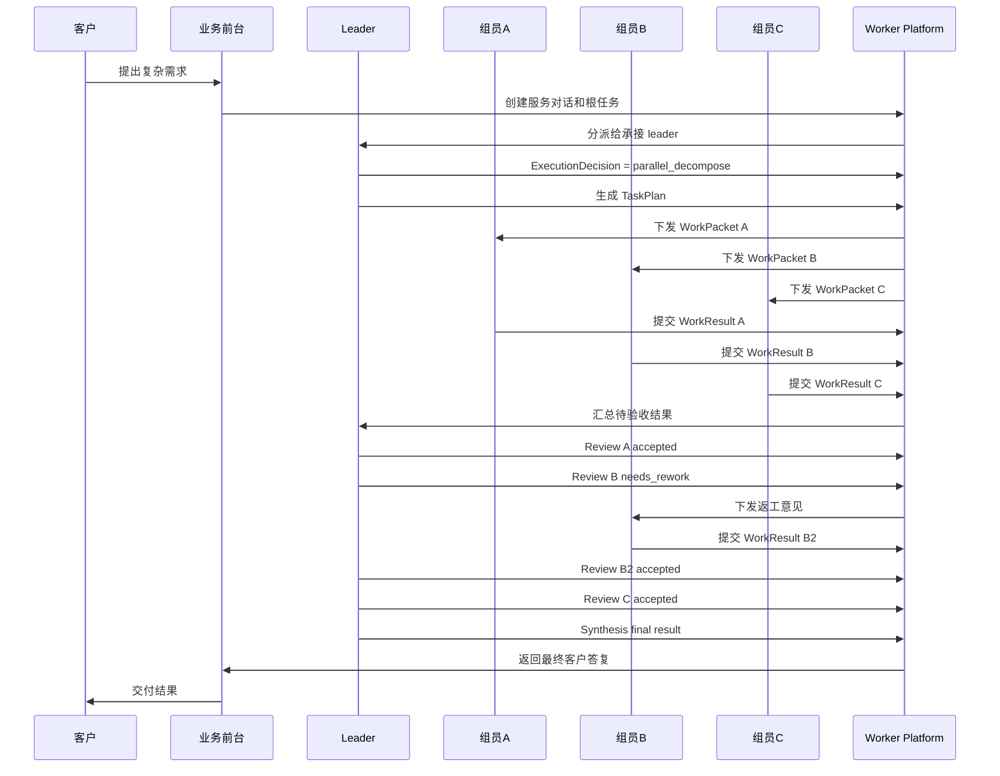

# siliconApeClub-worker-platform 重构设计方案

版本：v0.2  
日期：2026-06-29  
定位：按方案一重构 AI 员工平台的最终开发设计文档  

## 1. 决策结论

`siliconApeClub-worker-platform` 重构采用方案一：

```text
Java 21 / Spring Boot Worker Platform Core
  + Temporal durable workflow
  + PostgreSQL runtime ledger
  + Kafka/Redpanda domain event backbone
  + Keycloak identity
  + OpenTelemetry observability
  + Spring AI Model Gateway
  + MCP / HTTP Tool Gateway
  + Python LangGraph Agent Worker as optional execution engine
  + External business systems deployed and evolved independently
```

本次重构不按旧 FastAPI MVP 做渐进式兼容重构，而是按最终目标架构直接重建。

当前处于研发阶段，最重要的是架构纯洁性：

- 领域边界一次设计清楚。
- 任务、组织、权限、知识、模型、Skill、成本、审计各归其位。
- 外部业务系统完全隔离。
- AI 员工组织运行时成为平台核心。
- 未来上线后再考虑部署拆分、灰度迁移和稳定性工程。

## 2. 产品边界

硅基猿猴俱乐部是 **AI 员工组织**，不是业务系统。

Worker Platform 的职责是：

- 接待客户。
- 管理服务对话。
- 运行 AI 员工组织。
- 按组织关系拆解和调度任务。
- 加载岗位知识、Skill、模型和任务记忆。
- 控制 AI 员工对外部业务系统的授权调用。
- 记录任务账本、协作账本、成本账本和审计证据。
- 将任务成果沉淀为候选 Wiki 或 Skill proposal。

Worker Platform 不负责：

- 实现订单系统。
- 实现支付系统。
- 实现合同系统。
- 实现库存系统。
- 实现信贷系统。
- 成为客户主数据事实源。
- 保存外部业务系统的业务事实。

AI 员工对客时更像客户代理或组织授权员工：

```text
客户提出诉求
  -> AI 员工理解和澄清
  -> AI 员工选择被授权 Skill
  -> Tool Gateway 执行授权、审计、幂等和协议转换
  -> 独立业务系统完成真实业务动作
  -> AI 员工向客户解释结果并继续服务
```

业务事实归属：

| 数据 | 事实源 |
| --- | --- |
| 服务对话、消息、任务、协作、成本、模型调用、工具调用证据 | Worker Platform |
| 订单、支付、合同、库存、工单、信贷、客户主数据 | 独立业务系统 |
| 组织、员工、岗位、技能、模型配置、客户可见性 | 管理台配置源，Worker Platform 运行时投影 |
| Wiki、岗位知识、RAG 索引、任务记忆 | 知识层服务和管理台知识资产 |

## 3. 目标工程形态

研发期直接重构为一个 Java 21 / Spring Boot 工程：

```text
siliconApeClub-worker-platform/
  pom.xml
  src/main/java/com/siliconape/club/workerplatform/
    WorkerPlatformApplication.java
    gateway/
    application/
    domain/
    workflow/
    infrastructure/
    interfaces/
    shared/
  src/main/resources/
    application.yml
    db/migration/
  Dockerfile
```

不是立刻拆成多个微服务，而是在一个部署单元内保持模块纯净。

未来如果需要拆分，可按 profile 或模块拆出：

- Worker Gateway
- Temporal Worker
- Model Gateway
- Tool Gateway
- Knowledge Bridge
- Cost Analytics Worker

但当前开发阶段先保持一个后端工程，降低部署复杂度，把精力放在领域模型和 workflow 正确性上。

## 4. 模块设计

### 4.1 gateway

负责浏览器和外部客户端入口。

包建议：

```text
gateway/
  controller/
  dto/
  mapper/
  security/
  stream/
```

职责：

- `/api/worker-platform/**` REST API。
- 登录态校验。
- 会话查询。
- 消息发送。
- 客户服务入口打开。
- 员工直通。
- 任务状态查询。
- SSE / WebSocket 流式输出。
- typed block 协议转换。

gateway 不直接承载复杂业务逻辑，只把请求转成 application command。

### 4.2 application

负责应用用例编排。

包建议：

```text
application/
  command/
  query/
  service/
  port/
```

核心服务：

| Service | 职责 |
| --- | --- |
| `AuthApplicationService` | 登录、me、token、principal 装配 |
| `ConversationApplicationService` | 服务对话、会话、消息 |
| `CustomerServiceEntryApplicationService` | 客户服务入口打开、表单协议 |
| `TaskApplicationService` | 创建任务、查询任务、取消、恢复、转派 |
| `EmployeeApplicationService` | 员工直通、员工详情、员工 Skill |
| `WorkflowApplicationService` | 启动和 signal Temporal workflow |
| `RuntimeContextApplicationService` | 装配 AI 员工执行上下文 |
| `CostApplicationService` | 成本账本和预算检查 |

### 4.3 domain

负责领域模型和领域规则。

包建议：

```text
domain/
  principal/
  customer/
  organization/
  employee/
  conversation/
  task/
  collaboration/
  skill/
  model/
  knowledge/
  tool/
  cost/
  policy/
```

domain 不依赖 Spring、数据库、HTTP、Temporal SDK。

核心聚合：

| 聚合 | 说明 |
| --- | --- |
| `ServiceConversation` | 客户服务对话聚合 |
| `AiEmployee` | AI 员工运行时投影 |
| `OrganizationUnit` | 公司、部门、团队、岗位组织单元 |
| `EmployeeRelation` | 上下级、协作、审核、咨询、派活关系 |
| `TaskRun` | 根任务和子任务的统一任务聚合 |
| `ExecutionDecision` | leader 对自做、委派、并行拆解、咨询或升级的执行策略决策 |
| `TaskPlan` | leader 对任务的执行计划，可能是不拆、自做、单派或多子任务拆解 |
| `WorkPacket` | leader 下发给组员的结构化工作包 |
| `WorkResult` | 组员提交的结构化工作结果 |
| `ReviewRecord` | leader 或 reviewer 的验收记录 |
| `CollaborationThread` | 内部协作消息流 |
| `WorkerSkill` | AI 员工可执行 Skill |
| `AuthorizedSkillCall` | 被授权 Skill 调用账本 |
| `ModelCallRecord` | 模型调用记录 |
| `ToolCallRecord` | 工具调用记录 |
| `CostLedger` | 成本账本 |

### 4.4 workflow

负责 Temporal workflow 和 activity。

包建议：

```text
workflow/
  definition/
  activity/
  worker/
  signal/
  payload/
```

核心 workflow：

| Workflow | 职责 |
| --- | --- |
| `ServiceConversationWorkflow` | 管理一次服务对话生命周期 |
| `LeaderTaskWorkflow` | leader 根任务，负责执行策略决策、自做、拆解、派发、验收和汇总 |
| `SubTaskWorkflow` | 组员子任务，负责执行、追问、提交结果 |
| `AuthorizedSkillWorkflow` | 被授权 Skill 调用外部业务系统 |
| `KnowledgeDepositionWorkflow` | 任务成果沉淀为 Wiki/Skill 候选 |
| `ReviewWorkflow` | 高风险结果审核、人工审核或 reviewer 审核 |

核心 activity：

| Activity | 职责 |
| --- | --- |
| `UnderstandDemandActivity` | 识别客户意图、目标、约束、风险 |
| `SelectLeaderActivity` | 选择承接部门和 leader |
| `BuildRuntimeContextActivity` | 装配 AI 员工运行时上下文 |
| `DecideExecutionStrategyActivity` | leader 生成 ExecutionDecision，判断自做、单派、拆分、咨询或升级 |
| `PlanTaskActivity` | leader 根据 ExecutionDecision 生成结构化 TaskPlan |
| `ValidateTaskPlanActivity` | 校验拆解方案、权限、预算和依赖 |
| `DispatchWorkPacketActivity` | 生成并持久化 WorkPacket |
| `ExecuteLeaderSelfActivity` | leader 自己完成简单任务 |
| `ExecuteEmployeeWorkActivity` | 调用模型、知识和 Skill 完成组员子任务 |
| `ReviewWorkResultActivity` | leader 验收单个 WorkResult |
| `SynthesizeFinalResultActivity` | leader 综合子任务结果 |
| `CallAuthorizedSkillActivity` | 通过 Tool Gateway 调用外部业务系统 |
| `RecordCostActivity` | 记录模型、工具和任务成本 |
| `ProposeKnowledgeActivity` | 生成候选 Wiki 或 Skill proposal |

### 4.5 infrastructure

负责技术实现适配。

包建议：

```text
infrastructure/
  persistence/
  temporal/
  keycloak/
  model/
  tool/
  knowledge/
  event/
  observability/
  adminsync/
```

职责：

- JPA / MyBatis / jOOQ 持久化。
- Flyway 数据库迁移。
- Temporal client 和 worker。
- Keycloak OIDC 适配。
- Spring AI 模型调用。
- Tool Gateway HTTP / MCP 适配。
- Knowledge Runtime / Retrieval / Task Memory 客户端。
- Kafka / Redpanda 领域事件。
- OpenTelemetry tracing。
- 管理台配置投影同步。

### 4.6 interfaces

负责跨服务契约和内部 DTO。

包建议：

```text
interfaces/
  admin/
  knowledge/
  retrieval/
  memory/
  tool/
  model/
  event/
```

### 4.7 shared

公共工具：

```text
shared/
  id/
  json/
  time/
  error/
  money/
  token/
  validation/
```

## 5. 组织协作核心设计

### 5.1 组织不是角色扮演，而是运行时约束

AI 员工协作不能依赖 prompt 中写“你是 leader，他是组员”。  
平台必须把组织关系变成可执行约束：

- 谁能接待客户。
- 谁能当 leader。
- 谁能被派子任务。
- 谁可以审核谁。
- 谁可以咨询谁。
- 谁可以调用哪些 Skill。
- 谁可以访问哪些知识。
- 谁可以使用哪些模型。
- 谁有多少成本预算。

组织关系进入 `EmployeeRuntimeContext`，每次任务执行都必须携带。

### 5.2 员工关系类型

建议支持以下关系：

| relationType | 含义 |
| --- | --- |
| `reports_to` | 上下级 |
| `leads` | leader 负责某团队或岗位 |
| `collaborates_with` | 常规协作关系 |
| `reviews` | 审核关系 |
| `consults` | 可咨询 |
| `assigns` | 可派活 |
| `backup_for` | 备份员工 |
| `escalates_to` | 升级对象 |

### 5.3 岗位专精

每个岗位必须有自己的 runtime profile：

| Profile | 说明 |
| --- | --- |
| `positionCode` | 岗位编码 |
| `mission` | 岗位使命 |
| `responsibilities` | 岗位职责 |
| `knowledgeProfileCode` | 岗位知识包 |
| `allowedSkillCodes` | 可绑定 Skill 范围 |
| `defaultModelProfileCode` | 默认执行模型 |
| `planningModelProfileCode` | 规划模型，可为空 |
| `reviewModelProfileCode` | 审核模型，可为空 |
| `costPolicyCode` | 成本策略 |
| `qualityPolicyCode` | 质量策略 |
| `riskPolicyCode` | 风险策略 |

岗位专精决定：

- 员工能解决什么问题。
- 默认加载什么知识。
- 默认能调用什么 Skill。
- 默认使用什么模型。
- 需要什么验收标准。
- 什么场景必须升级给 leader 或 reviewer。

### 5.4 员工多岗位绑定

一个 AI 员工可以绑定多个岗位。

这样设计的原因是：业务领域里很多岗位职责不同，但工作方式、知识背景或 Skill 集合非常接近。如果强行拆成多个 AI 员工，会增加上下文传递、协作等待和验收成本；如果让一个 AI 员工兼具多个相关岗位，反而能在同一任务中形成更好的连续性。

多岗位绑定规则：

| 字段 | 说明 |
| --- | --- |
| `employeeId` | AI 员工 |
| `positionCode` | 绑定岗位 |
| `bindingType` | primary / secondary / temporary |
| `priority` | 岗位优先级 |
| `knowledgeProfileCode` | 该岗位知识包 |
| `skillScope` | 该岗位允许 Skill 范围 |
| `modelPolicyCode` | 该岗位模型策略 |
| `costPolicyCode` | 该岗位成本策略 |
| `enabled` | 是否启用 |

运行规则：

- 每个员工必须有一个主岗位。
- 每次执行任务时必须选择一个 `activePositionProfile`。
- 同一员工可以因为兼岗而成为多个子任务的候选人。
- leader 做执行策略决策时，应把“同一员工兼具相关岗位”作为降低沟通成本的因素。
- 绩效和成本既要记到员工，也要记到本次任务激活的岗位。

## 6. Leader 与组员协作机制

### 6.1 总体原则

leader 不只是“回复更长的 AI 员工”。  
leader 是任务 owner，负责：

- 理解需求。
- 澄清目标。
- 判断自己直接做、单独委派、并行拆分、顺序拆分、先咨询还是升级审核哪种方式更优。
- 制定执行计划。
- 选择组员。
- 下发工作包。
- 处理阻塞和追问。
- 验收组员结果。
- 冲突协调。
- 综合最终结果。
- 对客户交付。
- 触发知识沉淀。

leader 的核心能力是“组织调度决策”，而不是机械拆任务。  
平台必须允许 leader 根据成本、效率、质量、风险和岗位匹配度选择不同执行模式。

### 6.2 执行策略决策：ExecutionDecision

leader 收到任务后，第一步不是直接拆分，而是生成 `ExecutionDecision`。

执行模式：

| executionMode | 说明 | 典型场景 |
| --- | --- | --- |
| `leader_self_execute` | leader 自己完成 | 简单、短周期、上下文集中、leader 能力足够 |
| `single_delegate` | 下发给一个更合适的组员 | 某组员 Skill、知识包或岗位模型明显更匹配 |
| `parallel_decompose` | 拆成多个子任务并行执行 | 周期长、可并行、需要多个岗位专精 |
| `sequential_decompose` | 拆成多个有依赖的子任务顺序执行 | 前后依赖明显，如调研后设计、设计后实现 |
| `consult_then_execute` | 咨询专精员工后由 leader 完成 | 需要少量专业判断，但不值得完整委派 |
| `escalate_or_review` | 升级或增加 reviewer | 高风险、高价值、合规敏感 |
| `clarify_before_plan` | 先追问再决策 | 客户目标、材料或验收标准不足 |

决策字段：

| 字段 | 说明 |
| --- | --- |
| `rootTaskId` | 根任务 |
| `leaderEmployeeId` | leader |
| `executionMode` | 执行模式 |
| `decisionReason` | 决策理由 |
| `complexityScore` | 复杂度 |
| `parallelBenefitScore` | 并行收益 |
| `contextTransferCost` | 上下文传递成本 |
| `leaderFitScore` | leader 自做匹配度 |
| `bestAssigneeFitScore` | 最佳组员匹配度 |
| `estimatedSelfCost` | leader 自做成本 |
| `estimatedDelegationCost` | 委派成本 |
| `estimatedDuration` | 预计周期 |
| `qualityGain` | 委派或拆分带来的质量收益 |
| `riskLevel` | 风险等级 |
| `recommendedReviewer` | 推荐审核人 |

决策原则：

- 简单任务优先 leader 自做，避免无意义沟通损耗。
- 专精任务优先给最匹配岗位或 Skill 的员工。
- 长周期任务优先判断是否可并行。
- 上下文高度耦合任务谨慎拆分。
- 高风险任务即使 leader 能做，也应增加 reviewer。
- 低价值任务不应消耗高成本模型和多人协作。
- 一个多岗位员工可覆盖多个相关职责时，应优先考虑减少跨员工传递。

### 6.3 组员职责

组员负责：

- 接收结构化工作包。
- 加载自己的岗位知识、Skill 和模型。
- 在授权边界内完成子任务。
- 输出结构化工作结果。
- 提交证据、引用、工具调用记录和风险。
- 按 leader 反馈返工。

### 6.4 信息传输对象：WorkPacket

leader 给组员下达任务时，不能只发一句自然语言。  
必须生成 `WorkPacket`。

字段建议：

| 字段 | 说明 |
| --- | --- |
| `id` | 工作包 ID |
| `rootTaskId` | 总任务 ID |
| `subTaskId` | 子任务 ID |
| `leaderEmployeeId` | leader |
| `assigneeEmployeeId` | 执行组员 |
| `activePositionCode` | 本次执行激活岗位 |
| `title` | 子任务标题 |
| `goal` | 子任务目标 |
| `background` | 背景说明 |
| `customerVisible` | 结果是否可直接给客户看 |
| `inputRefs` | 输入材料、消息、附件、知识引用 |
| `constraints` | 约束条件 |
| `knowledgeScope` | 可读知识范围 |
| `allowedSkills` | 可调用 Skill |
| `outputContract` | 输出结构契约 |
| `acceptanceCriteria` | 验收标准 |
| `dependencies` | 依赖子任务 |
| `budget` | Token 和工具成本预算 |
| `deadline` | 截止时间 |
| `riskLevel` | 风险等级 |
| `replyTo` | 结果回传给哪个 workflow |

### 6.5 组员回传对象：WorkResult

组员完成后必须提交 `WorkResult`。

字段建议：

| 字段 | 说明 |
| --- | --- |
| `id` | 结果 ID |
| `workPacketId` | 对应工作包 |
| `subTaskId` | 子任务 ID |
| `assigneeEmployeeId` | 执行组员 |
| `activePositionCode` | 本次执行岗位 |
| `status` | completed / blocked / failed |
| `summary` | 简要结论 |
| `details` | 详细结果 |
| `deliverables` | 产出物引用 |
| `citations` | 知识引用 |
| `toolCalls` | Skill / Tool 调用证据 |
| `openQuestions` | 未解决问题 |
| `risks` | 风险提示 |
| `selfReview` | 自检结果 |
| `costUsage` | Token 和工具成本 |
| `wikiCandidates` | 候选知识 |
| `skillProposals` | 候选技能 |

### 6.6 leader 验收对象：ReviewRecord

leader 收到每个 `WorkResult` 后生成 `ReviewRecord`。

字段建议：

| 字段 | 说明 |
| --- | --- |
| `id` | 验收记录 ID |
| `rootTaskId` | 总任务 |
| `subTaskId` | 子任务 |
| `workResultId` | 被验收结果 |
| `reviewerEmployeeId` | leader 或 reviewer |
| `outcome` | accepted / needs_rework / rejected / escalated |
| `score` | 质量分 |
| `contractCheck` | 输出契约检查 |
| `evidenceCheck` | 证据检查 |
| `qualityCheck` | 质量检查 |
| `feedback` | 返工意见 |
| `nextAction` | 下一步动作 |

### 6.7 三个组员并行任务示例



### 6.8 组员阻塞和追问

组员不能直接随意向客户发问。  
当组员发现信息不足时，提交 `ClarificationRequest`：

| 字段 | 说明 |
| --- | --- |
| `subTaskId` | 子任务 |
| `assigneeEmployeeId` | 组员 |
| `question` | 需要澄清的问题 |
| `reason` | 为什么需要 |
| `impact` | 不澄清的影响 |
| `suggestedOptions` | 可选项 |
| `askCustomer` | 是否建议问客户 |

leader 决策：

- leader 自己能回答，则补充上下文给组员。
- 需要客户确认，则由业务前台或 leader 输出客户可见 form / markdown。
- 不影响主任务，则记录风险后继续。
- 信息缺失导致无法执行，则暂停子任务。

### 6.9 返工机制

当 `ReviewRecord.outcome = needs_rework`：

```text
leader review failed
  -> 生成 ReworkRequest
  -> 原 WorkPacket 增加 revision
  -> 组员按 feedback 重新执行
  -> 提交新的 WorkResult
  -> leader 再次验收
```

返工次数由 `qualityPolicy` 控制。超过次数后：

- 转派给备份员工。
- 升级给 reviewer。
- 请求人工介入。
- 降级交付并标记风险。

## 7. 需求识别、执行决策与任务拆解

### 7.1 需求识别流程

```text
客户消息
  -> intent_classification
  -> 是否命中客户服务入口
  -> 是否需要结构化表单
  -> 是否为简单问答
  -> 是否需要组织派发
  -> 是否需要 leader 处理
  -> leader 判断执行策略
  -> 是否高风险需要审核
```

识别依据：

- 客户服务入口关键词和表单。
- 历史对话上下文。
- 客户身份和权限。
- 组织职责边界。
- Skill 可用性。
- 岗位知识包。
- 任务风险等级。
- 预估成本。
- 预估协作损耗。
- leader 和候选员工匹配度。
- 是否需要外部业务系统调用。

### 7.2 ExecutionDecision

`ExecutionDecision` 是 leader 的第一层决策输出。

它回答的问题不是“怎么拆”，而是“这件事应该由谁、以什么组织方式完成”。

决策输入：

| 输入 | 说明 |
| --- | --- |
| `demandUnderstanding` | 需求理解结果 |
| `leaderRuntimeContext` | leader 上下文 |
| `candidateEmployees` | 候选员工 |
| `capabilityMatrix` | 岗位、Skill、知识和模型匹配矩阵 |
| `costEstimate` | 自做、单派、拆分的成本估算 |
| `durationEstimate` | 周期估算 |
| `riskAssessment` | 风险评估 |
| `customerSla` | 客户时效要求 |

执行模式分流：

```text
leader_self_execute
  -> ExecuteLeaderSelfActivity
  -> Review self result if needed
  -> Customer reply / artifact

single_delegate
  -> Generate one WorkPacket
  -> Start one SubTaskWorkflow
  -> Review WorkResult
  -> Customer reply / artifact

parallel_decompose
  -> Generate TaskPlan with multiple parallel subtasks
  -> Start multiple SubTaskWorkflow
  -> Review each WorkResult
  -> Synthesis

sequential_decompose
  -> Generate TaskPlan with DAG dependencies
  -> Execute by dependency order
  -> Review and Synthesis

consult_then_execute
  -> Ask one or more employees for structured advice
  -> Leader executes final answer

escalate_or_review
  -> Add reviewer or escalate to upper leader

clarify_before_plan
  -> Ask customer / internal user for missing data
```

### 7.3 TaskPlan

leader 只有在需要计划化执行时才输出 `TaskPlan`。  
`TaskPlan` 不一定包含多个子任务，它也可以表示 leader 自做、单派或咨询后的执行计划。

字段建议：

| 字段 | 说明 |
| --- | --- |
| `rootTaskId` | 总任务 |
| `leaderEmployeeId` | leader |
| `executionDecisionId` | 对应执行策略决策 |
| `executionMode` | 执行模式 |
| `goal` | 总目标 |
| `scope` | 范围 |
| `outOfScope` | 非范围 |
| `assumptions` | 假设 |
| `riskLevel` | 风险 |
| `subTasks` | 子任务列表 |
| `dependencies` | 子任务依赖图 |
| `acceptanceCriteria` | 总体验收标准 |
| `budgetPlan` | 成本预算 |
| `modelPlan` | 模型选择策略 |
| `reviewPlan` | 审核策略 |
| `customerCommunicationPlan` | 需要向客户确认的事项 |

子任务字段：

| 字段 | 说明 |
| --- | --- |
| `subTaskCode` | 子任务编码 |
| `title` | 标题 |
| `goal` | 目标 |
| `assigneeRole` | 期望岗位 |
| `candidateEmployees` | 候选员工 |
| `requiredSkills` | 所需 Skill |
| `knowledgeScope` | 知识范围 |
| `outputContract` | 输出契约 |
| `acceptanceCriteria` | 子任务验收标准 |
| `dependsOn` | 依赖子任务 |
| `parallelizable` | 是否可并行 |
| `budget` | 成本预算 |
| `deadline` | 截止时间 |

### 7.4 拆解策略

拆解只有在 `ExecutionDecision` 判断为 `parallel_decompose` 或 `sequential_decompose` 时才发生。

拆解不是单纯让大模型自由发挥，必须由模型和规则共同完成。

步骤：

1. `DemandUnderstandingActivity` 抽取目标、约束、材料、期望输出。
2. `OrgCapabilityMatrix` 查询哪些部门和岗位适合处理。
3. `SkillCatalog` 查询可用 Skill。
4. `KnowledgeProfile` 查询岗位知识范围。
5. `EmployeeAvailability` 查询员工状态、负载和成本。
6. `ExecutionDecisionModel` 生成执行策略。
7. `TaskPlanningModel` 在需要拆解时生成结构化计划。
8. `ValidateTaskPlanActivity` 校验越权、超预算、依赖错误、无员工可接。
9. `LeaderTaskWorkflow` 根据执行模式自做、单派、并行或顺序执行。

### 7.5 执行决策质量控制

执行决策必须通过校验：

- leader 自做时，leader 必须具备对应岗位、Skill、知识或模型能力。
- 单派时，目标员工匹配度必须高于 leader 自做收益阈值。
- 并行拆分时，并行收益必须高于协作损耗。
- 顺序拆分时，依赖必须形成 DAG。
- 咨询后自做时，咨询问题必须明确且成本低于完整委派。
- 高风险任务必须配置 reviewer。
- 低价值任务不得触发过多员工协作或高成本模型。

### 7.6 拆解质量控制

拆解方案必须通过校验：

- 每个子任务有明确 owner。
- 每个子任务有输出契约。
- 每个子任务有验收标准。
- 每个子任务有权限边界。
- 每个子任务有预算。
- 所有依赖形成 DAG，不能循环依赖。
- 高风险任务必须有 reviewer。
- 需要客户确认的信息不能伪造。

## 8. 模型策略

### 8.1 模型不绑定全平台，而绑定岗位和任务阶段

不同岗位使用不同模型是硅基猿猴俱乐部的重要能力。

模型选择顺序：

```text
task stage override
  -> employee override
  -> position default
  -> organization default
  -> platform fallback
```

### 8.2 模型用途

| purpose | 使用场景 | 策略 |
| --- | --- | --- |
| `intent_classification` | 意图识别 | 低成本、低延迟 |
| `customer_reply` | 客户对话 | 稳定、语气可控 |
| `task_planning` | leader 拆解 | 强推理、结构化输出 |
| `employee_execution` | 组员执行 | 岗位专用 |
| `work_review` | leader 验收 | 高准确性、重证据 |
| `synthesis` | 汇总交付 | 长上下文、强总结 |
| `knowledge_writing` | Wiki 候选 | 稳定、结构化 |
| `skill_proposal` | Skill 候选 | 结构化、可审计 |

### 8.3 岗位模型配置

管理台组织与人力中心应维护：

- 岗位默认模型。
- 员工覆盖模型。
- leader 规划模型。
- reviewer 审核模型。
- 成本上限。
- fallback 规则。
- 高风险升级模型。

Worker Platform 启动任务时装配到 `EmployeeRuntimeContext`。

### 8.4 成本质量策略

成本控制不是一味使用小模型，而是按任务价值分层：

| 场景 | 策略 |
| --- | --- |
| 简单客服、查询、固定表单 | 低成本模型或不调用模型 |
| 需求澄清 | 中等模型 |
| leader 拆复杂任务 | 强推理模型 |
| 组员执行局部任务 | 岗位专用模型 |
| 高风险验收 | 高质量模型或 reviewer |
| 最终客户交付 | 稳定表达模型 |

每次模型调用必须写入：

- `wp_model_call`
- `wp_cost_ledger`
- `task_event`
- OpenTelemetry trace

## 9. Temporal Workflow 设计

### 9.1 ServiceConversationWorkflow

职责：

- 接收客户消息。
- 识别意图。
- 判断是否需要表单。
- 判断是否直接回答。
- 判断是否创建任务。
- 选择业务前台或 leader。
- 启动 `LeaderTaskWorkflow`。

状态：

| 状态 | 说明 |
| --- | --- |
| `active` | 对话进行中 |
| `waiting_customer` | 等客户补充信息 |
| `task_running` | 已进入任务执行 |
| `completed` | 对话完成 |
| `archived` | 归档 |

### 9.2 LeaderTaskWorkflow

职责：

- 接收根任务。
- 加载 leader runtime context。
- 生成 ExecutionDecision。
- 按执行模式决定自做、单派、并行拆分、顺序拆分、咨询或升级。
- 必要时生成 TaskPlan。
- 校验 TaskPlan。
- 必要时创建子任务。
- 必要时并发或按依赖执行子任务。
- 接收 WorkResult。
- 生成 ReviewRecord。
- 处理返工、转派、升级。
- 综合最终结果。
- 输出客户可见结果。

伪代码：

```java
public final class LeaderTaskWorkflowImpl implements LeaderTaskWorkflow {
    public TaskFinalResult run(LeaderTaskCommand command) {
        RuntimeContext leaderContext = activities.buildRuntimeContext(command.leaderEmployeeId(), command.rootTaskId());
        ExecutionDecision decision = activities.decideExecutionStrategy(command, leaderContext);

        if (decision.executionMode() == ExecutionMode.CLARIFY_BEFORE_PLAN) {
            signalCustomerClarification(decision.clarificationQuestions());
            waitForCustomerInput();
            decision = activities.decideExecutionStrategy(command, leaderContext);
        }

        if (decision.executionMode() == ExecutionMode.LEADER_SELF_EXECUTE) {
            WorkResult selfResult = activities.executeLeaderSelf(command, leaderContext, decision);
            ReviewRecord review = activities.reviewSelfResult(command, selfResult, leaderContext);
            return activities.finalizeLeaderSelfResult(command, selfResult, review);
        }

        if (decision.executionMode() == ExecutionMode.CONSULT_THEN_EXECUTE) {
            List<ConsultResult> advice = requestConsultations(decision);
            WorkResult leaderResult = activities.executeLeaderWithAdvice(command, leaderContext, advice);
            return activities.finalizeLeaderSelfResult(command, leaderResult, null);
        }

        if (decision.executionMode() == ExecutionMode.ESCALATE_OR_REVIEW) {
            return signalReviewerOrUpperLeader(command, decision);
        }

        TaskPlan plan = activities.planTask(command, leaderContext, decision);
        PlanValidation validation = activities.validateTaskPlan(plan);

        if (validation.requiresClarification()) {
            signalCustomerClarification(validation.questions());
            waitForCustomerInput();
            return run(command);
        }

        List<SubTaskHandle> handles = dispatchByExecutionMode(plan);
        List<WorkResult> results = waitForSubTaskResults(handles);

        List<ReviewRecord> reviews = reviewAndReworkUntilAccepted(results, plan);
        TaskFinalResult finalResult = activities.synthesizeFinalResult(command, plan, reviews);
        activities.proposeKnowledgeIfNeeded(finalResult);
        return finalResult;
    }
}
```

### 9.3 SubTaskWorkflow

职责：

- 接收 WorkPacket。
- 加载组员 runtime context。
- 检查权限、Skill、知识范围和预算。
- 执行子任务。
- 需要澄清时 signal leader。
- 调用知识、模型、Skill。
- 提交 WorkResult。
- 处理返工。

状态：

| 状态 | 说明 |
| --- | --- |
| `assigned` | 已下发 |
| `accepted` | 组员接收 |
| `running` | 执行中 |
| `blocked` | 等待澄清 |
| `submitted` | 已提交结果 |
| `rework` | 返工中 |
| `accepted_by_leader` | leader 验收通过 |
| `cancelled` | 已取消 |

### 9.4 AuthorizedSkillWorkflow

职责：

- 校验 AI 员工是否拥有 Skill。
- 校验客户是否授权。
- 校验业务入参。
- 生成幂等键。
- 调用 Tool Gateway。
- 写入 ToolCallRecord。
- 返回业务系统结果引用。

注意：

- 外部业务系统是事实源。
- Worker Platform 只保存调用证据和结果引用。
- 不把订单、合同等外部业务对象复制为平台事实。

### 9.5 ReviewWorkflow

用于：

- 高风险任务。
- 高价值客户。
- 合规敏感输出。
- leader 自检未通过。
- 子任务结果冲突。
- 外部系统调用失败或异常。

reviewer 可以是：

- 上级 AI 员工。
- 专职审核 AI 员工。
- 内部人类管理员。

## 10. 数据库设计

### 10.1 命名原则

运行时表继续使用 `wp_` 前缀。

建议 schema：

```text
wp_runtime
wp_audit
wp_cost
wp_projection
```

研发阶段也可以先使用单 schema，但表职责必须清楚。

### 10.2 核心表

#### 10.2.1 身份与组织投影

| 表 | 说明 |
| --- | --- |
| `wp_principal` | 登录主体投影 |
| `wp_customer_profile` | 客户资料投影 |
| `wp_org_unit` | 组织单元 |
| `wp_position_profile` | 岗位 runtime profile |
| `wp_employee_position_binding` | 员工多岗位绑定 |
| `wp_ai_employee` | AI 员工投影 |
| `wp_employee_relation` | 员工关系 |
| `wp_employee_permission` | 主体对员工权限 |
| `wp_employee_model_policy` | 员工模型策略投影 |

#### 10.2.2 会话与消息

| 表 | 说明 |
| --- | --- |
| `wp_service_conversation` | 服务对话，替代旧 `wp_demand_group` 语义 |
| `wp_conversation_session` | 会话 |
| `wp_message` | typed block 消息 |
| `wp_message_visibility` | 消息可见性 |
| `wp_form_submission` | 结构化表单提交 |

#### 10.2.3 任务与协作

| 表 | 说明 |
| --- | --- |
| `wp_task_run` | 根任务和子任务 |
| `wp_task_dependency` | 子任务依赖 |
| `wp_task_event` | 任务事件 |
| `wp_task_checkpoint` | checkpoint |
| `wp_task_assignment` | 任务分派 |
| `wp_execution_decision` | leader 执行策略决策 |
| `wp_task_plan` | leader 拆解计划 |
| `wp_work_packet` | 工作包 |
| `wp_work_result` | 工作结果 |
| `wp_review_record` | 验收记录 |
| `wp_rework_request` | 返工请求 |
| `wp_clarification_request` | 澄清请求 |
| `wp_collaboration_thread` | 内部协作线程 |
| `wp_collaboration_message` | 内部协作消息 |

#### 10.2.4 Skill、工具和外部业务系统调用

| 表 | 说明 |
| --- | --- |
| `wp_worker_skill` | 审核通过 Skill 投影 |
| `wp_skill_binding` | 员工 Skill 绑定 |
| `wp_authorized_skill_call` | 授权 Skill 调用 |
| `wp_tool_call` | Tool Gateway 调用记录 |
| `wp_external_system_ref` | 外部系统结果引用 |

#### 10.2.5 模型、成本和质量

| 表 | 说明 |
| --- | --- |
| `wp_model_call` | 模型调用 |
| `wp_cost_ledger` | 成本账本 |
| `wp_quality_evaluation` | 质量评估 |
| `wp_employee_performance_snapshot` | 员工绩效快照 |
| `wp_customer_roi_snapshot` | 客户 ROI 快照 |

#### 10.2.6 知识沉淀

| 表 | 说明 |
| --- | --- |
| `wp_knowledge_citation` | 任务知识引用 |
| `wp_wiki_candidate` | 候选 Wiki |
| `wp_skill_proposal` | 候选 Skill |
| `wp_task_memory_ref` | 任务记忆引用 |

### 10.3 `wp_task_run` 关键字段

```text
id
root_task_id
parent_task_id
conversation_id
session_id
task_type
title
description
status
priority
risk_level
requested_by_principal_id
leader_employee_id
assigned_employee_id
active_position_code
assigned_org_unit_id
progress
execution_mode
execution_decision_id
acceptance_criteria_json
budget_json
model_policy_json
quality_policy_json
workflow_id
workflow_run_id
created_at
updated_at
completed_at
```

### 10.4 `wp_execution_decision` 关键字段

```text
id
root_task_id
leader_employee_id
execution_mode
decision_reason
complexity_score
parallel_benefit_score
context_transfer_cost
leader_fit_score
best_assignee_employee_id
best_assignee_fit_score
estimated_self_cost_json
estimated_delegation_cost_json
estimated_duration_minutes
quality_gain_score
risk_level
recommended_reviewer_employee_id
decision_input_json
decision_output_json
created_at
```

### 10.5 任务状态

根任务状态：

```text
created
intake
planning
waiting_customer
dispatching
executing
reviewing
synthesizing
completed
failed
cancelled
```

子任务状态：

```text
assigned
accepted
running
blocked
submitted
reviewing
rework
accepted_by_leader
failed
cancelled
```

## 11. API 设计

### 11.1 客户端 API

保持 `/api/worker-platform/**`。

#### Auth

```http
POST /api/worker-platform/auth/login
GET  /api/worker-platform/auth/me
POST /api/worker-platform/auth/logout
GET  /api/worker-platform/bootstrap
```

#### Conversation

```http
GET  /api/worker-platform/conversations
POST /api/worker-platform/conversations
GET  /api/worker-platform/conversations/{conversationId}
GET  /api/worker-platform/conversations/{conversationId}/sessions
POST /api/worker-platform/conversations/{conversationId}/sessions
GET  /api/worker-platform/sessions/{sessionId}/messages
POST /api/worker-platform/sessions/{sessionId}/messages
GET  /api/worker-platform/sessions/{sessionId}/stream
```

#### Customer service entry

```http
GET  /api/worker-platform/service-entries
POST /api/worker-platform/sessions/{sessionId}/service-entries/{entryCode}/open
```

当前系统可兼容旧命名：

```http
GET  /api/worker-platform/quick-capabilities
POST /api/worker-platform/sessions/{sessionId}/quick-capabilities/{capabilityCode}/open
```

但新代码内部统一命名为 `CustomerServiceEntry`。

#### Organization and employee

```http
GET  /api/worker-platform/org/tree
GET  /api/worker-platform/org/employees
GET  /api/worker-platform/org/employees/{employeeId}
GET  /api/worker-platform/org/employees/{employeeId}/skills
POST /api/worker-platform/org/employees/{employeeId}/consult
POST /api/worker-platform/org/employees/{employeeId}/assign
```

#### Task

```http
GET  /api/worker-platform/tasks
POST /api/worker-platform/tasks
GET  /api/worker-platform/tasks/{taskId}
GET  /api/worker-platform/tasks/{taskId}/tree
GET  /api/worker-platform/tasks/{taskId}/events
GET  /api/worker-platform/tasks/{taskId}/collaboration
POST /api/worker-platform/tasks/{taskId}/resume
POST /api/worker-platform/tasks/{taskId}/cancel
POST /api/worker-platform/tasks/{taskId}/handoff
POST /api/worker-platform/tasks/{taskId}/review
```

### 11.2 内部 API

内部 API 不给浏览器调用。

```http
POST /internal/workflows/conversations/{conversationId}/signal
POST /internal/workflows/tasks/{taskId}/signal
POST /internal/agent-runs
POST /internal/agent-runs/{runId}/resume
POST /internal/agent-runs/{runId}/cancel
GET  /internal/agent-runs/{runId}/events
```

### 11.3 typed block

继续支持：

| block | 用途 |
| --- | --- |
| `markdown` | 默认文本 |
| `html` | 受控展示 |
| `code` | 代码 |
| `image` | 图片 |
| `form` | 结构化输入 |
| `artifact` | 产出物 |
| `task_status` | 任务状态 |
| `org_route` | 组织路由 |
| `employee_card` | 员工卡片 |
| `handoff` | 交接 |
| `work_plan` | leader 拆解计划摘要 |
| `work_result` | 子任务结果摘要 |
| `review_record` | 验收摘要 |

客户默认只看到客户可见 block。内部人员可按权限看到更多协作细节。

## 12. Runtime Context

### 12.1 EmployeeRuntimeContext

AI 员工执行任何任务前必须装配上下文：

```json
{
  "principal": {},
  "customer": {},
  "conversation": {},
  "task": {},
  "employee": {},
  "position": {},
  "orgUnit": {},
  "relations": [],
  "permissions": {},
  "knowledgeProfile": {},
  "availableSkills": [],
  "modelPolicy": {},
  "costBudget": {},
  "qualityPolicy": {},
  "riskPolicy": {},
  "memoryRefs": [],
  "toolPolicy": {}
}
```

### 12.2 Context Snapshot

每次根任务和子任务启动时，保存 `wp_employee_runtime_context_snapshot`。

原因：

- 后续可回放。
- 模型输出可解释。
- 权限变化后不影响历史审计。
- 成本和质量分析有基准。

## 13. Tool Gateway

### 13.1 定位

Tool Gateway 是 AI 员工访问外部系统的受控边界。

它不实现业务系统，只负责：

- Skill 授权。
- 客户授权。
- 入参校验。
- 凭证隔离。
- 幂等。
- 限流。
- 审计。
- 协议转换。
- 结果标准化。

### 13.2 调用流程

```text
AI 员工请求 Skill 调用
  -> Runtime Core 检查 employee skill binding
  -> Policy 检查客户授权和任务权限
  -> Tool Gateway 校验 input schema
  -> 生成 idempotency key
  -> 调用外部业务系统
  -> 标准化结果
  -> 写 wp_tool_call / wp_authorized_skill_call
  -> 返回给 workflow
```

### 13.3 外部业务系统隔离

外部业务系统：

- 独立部署。
- 独立数据库。
- 独立技术栈。
- 独立运维。
- 独立发布。
- 独立 SLA。

科技部负责业务系统开发、测试、运维。

Worker Platform 只维护：

- 工具定义。
- 调用授权。
- 调用证据。
- 结果引用。
- 客户可见解释。

## 14. Knowledge Bridge

Worker Platform 不直连数据库读知识。

内部调用：

- Knowledge Runtime：岗位知识、must-read Wiki、知识 profile。
- Retrieval：RAG 检索。
- Task Memory：任务记忆。
- Admin Server：配置源和候选沉淀。

组员执行子任务时：

```text
SubTaskWorkflow
  -> BuildRuntimeContext
  -> KnowledgeBridge.loadPositionKnowledge
  -> Retrieval.search(task query)
  -> ExecuteEmployeeWork
  -> Write citation log
```

leader 汇总时：

```text
LeaderTaskWorkflow
  -> 收集所有 WorkResult citations
  -> 检查引用冲突
  -> 合并证据
  -> 生成最终引用清单
```

## 15. 事件与审计

### 15.1 Task Event

所有关键动作写 `wp_task_event`：

```text
CONVERSATION_CREATED
MESSAGE_RECEIVED
TASK_CREATED
LEADER_SELECTED
TASK_PLANNED
PLAN_VALIDATED
WORK_PACKET_ASSIGNED
WORK_PACKET_ACCEPTED
CLARIFICATION_REQUESTED
WORK_RESULT_SUBMITTED
WORK_RESULT_REVIEWED
REWORK_REQUESTED
SUBTASK_ACCEPTED
TASK_SYNTHESIZED
AUTHORIZED_SKILL_CALLED
MODEL_CALLED
TOOL_CALLED
KNOWLEDGE_CITED
TASK_COMPLETED
TASK_FAILED
TASK_CANCELLED
```

### 15.2 Kafka / Redpanda 领域事件

事件主题建议：

| Topic | 说明 |
| --- | --- |
| `worker.task.events` | 任务事件 |
| `worker.model.calls` | 模型调用 |
| `worker.tool.calls` | 工具调用 |
| `worker.cost.ledger` | 成本账本 |
| `worker.knowledge.proposals` | 知识沉淀候选 |
| `worker.audit.events` | 审计事件 |

研发期可以先由单应用发布事件，后续再独立消费。

## 16. 前端影响

AI 员工服务台前端继续保持：

- 左侧历史服务对话。
- 中间聊天消息流。
- 底部 composer。
- 右侧客户服务入口。
- 右侧员工直通。
- 任务状态展示。

新增能力：

- 展示 `work_plan` 摘要。
- 展示任务树。
- 内部人员可查看子任务、组员、验收记录。
- 外部客户只看到客户可见的任务进度和最终结果。
- SSE 接收 workflow 事件。

客户不需要理解内部组织复杂度。  
内部人员可以查看组织协作过程。

## 17. 开发落地顺序

这不是旧系统迁移路线，而是重构开发顺序。

### 17.1 工程骨架

- 新建 Java 21 Spring Boot 工程。
- 配置 Maven。
- 配置 Flyway。
- 配置 PostgreSQL。
- 配置 Dockerfile。
- 保持容器名和端口：`siliconapeclub-worker-platform:3010`。

### 17.2 基础 API

- Auth。
- Bootstrap。
- Conversation。
- Session。
- Message。
- Task query。
- Employee query。
- Service entry query。

### 17.3 运行时投影

- 管理台组织投影。
- 员工投影。
- Skill 投影。
- 模型策略投影。
- 客户可见性投影。

### 17.4 Temporal 接入

- 部署 Temporal。
- 接入 Java SDK。
- 实现 `ServiceConversationWorkflow`。
- 实现 `LeaderTaskWorkflow`。
- 实现 `SubTaskWorkflow`。
- 实现 workflow signal。

### 17.5 Leader 协作闭环

- `ExecutionDecision`。
- leader 自做。
- 单员工委派。
- `TaskPlan`。
- `WorkPacket`。
- `WorkResult`。
- `ReviewRecord`。
- 子任务并发。
- 返工。
- 综合汇总。

### 17.6 Model Gateway

- Spring AI 接入。
- 读取管理台模型配置。
- 实现 per-position model policy。
- 记录 `wp_model_call`。
- 记录 token 成本。

### 17.7 Tool Gateway

- Skill 授权校验。
- HTTP Adapter。
- MCP Adapter 预留。
- 幂等和审计。
- 外部业务系统调用证据。

### 17.8 Knowledge Bridge

- Knowledge Runtime 客户端。
- Retrieval 客户端。
- Task Memory 客户端。
- citation log。
- Wiki / Skill proposal。

### 17.9 成本与质量

- `wp_cost_ledger`。
- `wp_quality_evaluation`。
- 员工绩效快照。
- 客户 ROI 快照。

## 18. 验收标准

### 18.1 架构验收

- 后端为 Java 21 / Spring Boot。
- FastAPI MVP 不再作为正式 Worker Platform Core。
- 代码按 gateway/application/domain/workflow/infrastructure 分层。
- domain 不依赖技术框架。
- Temporal workflow 能运行。
- PostgreSQL schema 由 Flyway 管理。

### 18.2 组织协作验收

- leader 可以接收根任务。
- leader 可以生成 ExecutionDecision。
- leader 可以判断并执行 `leader_self_execute`，不创建子任务。
- leader 可以判断并执行 `single_delegate`，只创建一个 WorkPacket。
- leader 可以判断并执行 `parallel_decompose`，再创建多个 WorkPacket。
- leader 可以判断并执行 `consult_then_execute`，咨询后自己完成。
- leader 可以生成 TaskPlan。
- leader 可以拆出至少 3 个子任务。
- 平台可以并发下发 3 个 WorkPacket。
- 3 个组员可以分别提交 WorkResult。
- leader 可以逐个生成 ReviewRecord。
- 不合格子任务可以返工。
- 全部通过后 leader 可以综合汇总。
- 客户可以看到最终结果和任务状态。
- 内部人员可以看到协作过程。

### 18.3 岗位模型验收

- 不同岗位可配置不同模型。
- 一个员工可以绑定多个岗位。
- 员工执行任务时有明确 `activePositionProfile`。
- 多岗位员工的成本和绩效能按员工与激活岗位分别入账。
- leader 规划可使用独立模型。
- 组员执行可使用岗位模型。
- reviewer 可使用审核模型。
- 模型调用进入 `wp_model_call`。
- 成本进入 `wp_cost_ledger`。

### 18.4 外部业务系统边界验收

- 业务系统不与 Worker Platform 共库。
- 业务系统不作为 Worker Platform 模块。
- AI 员工只能通过 Skill + Tool Gateway 调用业务系统。
- 调用记录进入 `wp_authorized_skill_call` 和 `wp_tool_call`。
- 外部业务对象只保存引用和证据，不成为平台事实源。

### 18.5 知识闭环验收

- 任务启动加载岗位知识。
- 子任务检索知识时写 citation。
- leader 汇总时能看到子任务引用。
- 任务完成后可生成 Wiki candidate。
- Skill 经验可生成 Skill proposal。
- AI 员工不能直接发布正式 Wiki 或启用 Skill。

## 19. 最终判断

`siliconApeClub-worker-platform` 的重构目标不是换语言，也不是简单引入 Temporal。

真正目标是把 AI 员工平台从“聊天 + 任务记录”升级为：

> 一个可以像公司一样运行的 AI 员工组织核心。

在这个核心里：

- 客户通过对话和表单表达诉求。
- 业务前台负责接待和澄清。
- leader 负责判断自做、委派、拆解、咨询、升级、验收和汇总。
- 组员按岗位专精执行子任务。
- Skill 让 AI 员工能代表客户调用外部系统。
- 知识层让 AI 员工有可追溯的组织记忆。
- 模型策略让不同岗位获得不同成本和质量组合。
- 任务账本让一切可恢复、可回放、可审计。
- 成本账本让客户看到 AI 员工组织的投入产出。

这就是方案一在硅基猿猴俱乐部中的落地形态。
